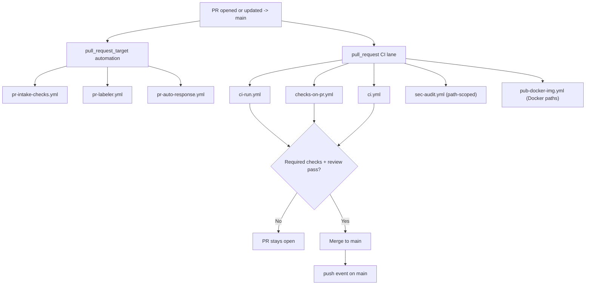
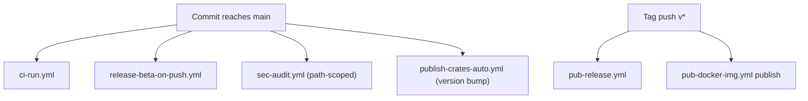

# Main Branch Delivery Flows

This document explains the canonical delivery model for R.A.I.N.: direct pull requests to the single default branch, `main`.

Use this with:

- [`docs/contributing/ci-map.md`](../../docs/contributing/ci-map.md)
- [`docs/contributing/pr-workflow.md`](../../docs/contributing/pr-workflow.md)
- [`docs/contributing/release-process.md`](../../docs/contributing/release-process.md)

## Canonical Branch Policy

R.A.I.N. uses a **single default branch** model:

- all contributor PRs target `main`
- maintainers merge reviewed PRs into `main`
- post-merge automation runs from `main`
- `dev -> main` promotion is retired

## Event Summary

| Event | Workflows |
| --- | --- |
| PR activity (`pull_request_target`) to `main` | `pr-intake-checks.yml`, `pr-labeler.yml`, `pr-auto-response.yml` |
| PR activity (`pull_request`) to `main` | `ci-run.yml`, `checks-on-pr.yml`, `ci.yml`, `sec-audit.yml`, plus path-scoped workflows |
| Push to `main` | `ci-run.yml`, `release-beta-on-push.yml`, `sec-audit.yml`, `publish-crates-auto.yml`, plus path-scoped workflows |
| Tag push (`v*`) | `pub-release.yml`, `pub-docker-img.yml` publish jobs |
| Manual / scheduled | `release-stable-manual.yml`, `cross-platform-build-manual.yml`, `pub-homebrew-core.yml`, `sec-codeql.yml`, `feature-matrix.yml`, `test-fuzz.yml`, `pr-check-stale.yml`, `pr-check-status.yml`, `sync-contributors.yml`, `test-benchmarks.yml`, `test-e2e.yml` |

## Step-By-Step

### 1) Pull request to `main`

1. A contributor opens or updates a PR with base branch `main`.
2. `pull_request_target` automation runs first:
   - `pr-intake-checks.yml` validates template completeness and posts sticky feedback.
   - `pr-labeler.yml` applies managed size/risk/scope/module labels.
   - `pr-auto-response.yml` handles first-interaction guidance and label-driven routing.
3. `pull_request` CI runs against the PR head:
   - `ci-run.yml` provides the merge-blocking Rust/docs gate.
   - `checks-on-pr.yml` runs the standalone quality gate matrix.
   - `ci.yml` runs Python integrity, `ruff`, and `pytest` checks.
   - `sec-audit.yml` runs dependency/license security checks when its path filters match.
   - `pub-docker-img.yml` runs a smoke build when Docker inputs change.
4. Maintainers merge only after the required review and branch-protection checks pass.
5. Merge emits a `push` event on `main`.

### 2) Push to `main`

1. A reviewed change lands on `main`.
2. Push-triggered automation runs:
   - `ci-run.yml` validates the merged state.
   - `release-beta-on-push.yml` builds and publishes the beta release artifacts for the latest `main` commit.
   - `sec-audit.yml` runs when security-sensitive paths changed.
   - `publish-crates-auto.yml` publishes crates.io updates after a version bump in `Cargo.toml`.
3. Additional path-scoped workflows run only when their filters match.

### 3) Tag push release flow

1. Maintainers push a `v*` tag from a commit already reachable from `main`.
2. `pub-release.yml` publishes signed release artifacts and GitHub Release metadata.
3. `pub-docker-img.yml` publishes the matching GHCR image tags.

## Merge / Policy Notes

- Branch protection should require PRs to `main`, at least one approval, and `CI Required Gate`.
- Workflow-owner approval still applies for `.github/workflows/**` changes through the existing CI guardrails.
- `main-promotion-gate.yml` is retained only as a retired manual note so old links do not imply an active promotion lane.

## Mermaid Diagrams

### PR to Main

### Main Push and Release

## Quick Troubleshooting

1. **PR blocked before CI finishes**: inspect the sticky comment from `pr-intake-checks.yml` and label automation runs.
2. **Required checks failing on a PR**: start with `ci-run.yml`, then `checks-on-pr.yml`, then `ci.yml` for Python/ruff/pytest failures.
3. **Beta release missing after merge**: confirm the change merged into `main` and inspect `release-beta-on-push.yml`.
4. **Unexpected promotion-language reference**: treat it as stale documentation and follow this file plus `CONTRIBUTING.md`.
