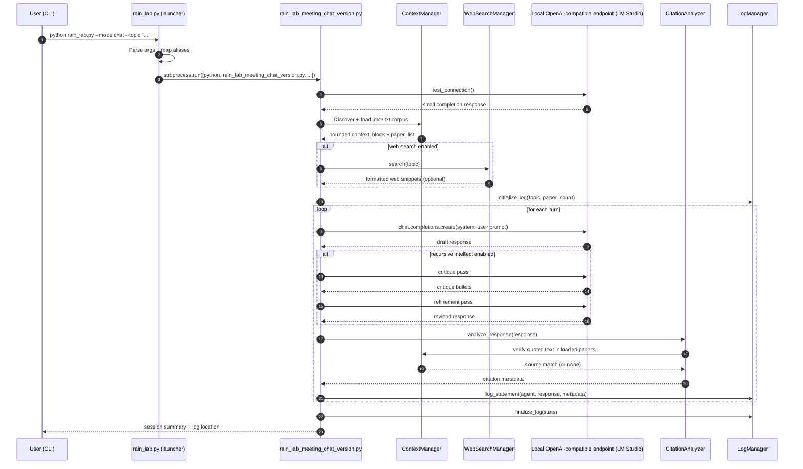

# R.A.I.N. Lab Architecture (Launcher + Chat Mode)

This document describes how the top-level `rain_lab.py` launcher and the chat backend (`rain_lab_meeting_chat_version.py`) execute a meeting.

## High-level flow

## Key implementation details

- **Launcher/router (`rain_lab.py`)**
  - Splits known args from passthrough args (`--` support).
  - Normalizes generic flags like `--turns` into mode-specific flags.
  - Executes the selected backend script via `subprocess.run`.

- **Config-driven backend (`rain_lab_meeting_chat_version.py`)**
  - Reads defaults from environment (`LM_STUDIO_MODEL`, `LM_STUDIO_BASE_URL`, recursive settings).
  - Builds a role-specialized 4-agent team (James/Jasmine/Luca/Elena).
  - Loads a bounded local corpus into prompt context; retains full text for post-hoc citation checks.

- **Inference loop**
  - Per-turn prompt includes:
    - agent identity/soul,
    - recent transcript window,
    - mission instruction,
    - shared context block.
  - Optional recursive refinement adds critique/rewrite passes before finalizing agent output.

- **Grounding and observability**
  - Quoted spans are extracted and fuzzily verified against loaded local papers.
  - Meeting transcripts and citation metadata are written to `RAIN_LAB_MEETING_LOG.md`, with archival rotation support.

## Failure/edge behavior

- If `openai` package is missing, startup exits with install guidance.
- If local endpoint is unavailable, connection test retries and prints troubleshooting hints.
- If web search packages are missing or rate-limited, meeting proceeds with local context only.
