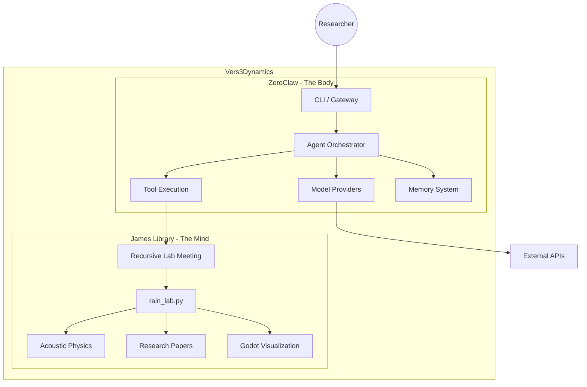

# Vers3Dynamics

<p align="center">
  
</p>

## Autonomous Acoustic Physics & Resonance Research Platform

<p align="center">
  <strong>
    Bridging autonomous AI agents with complex acoustic physics research —
    simulating resonance, cymatics, and bio-acoustic phenomena through a unified Rust-first execution engine.
  </strong>
</p>

<p align="center">
  
  
  
  
  
</p>

---

## Mission Statement

Vers3Dynamics' R.A.I.N. Lab is an R&D platform for **non-linear wave interactions** and **bio-acoustic phenomena**. 

We combine:

- **ZeroClaw** (The Body): A high-performance Rust AI Agent Engine for autonomous tool execution
- **James Library** (The Mind): Python-based acoustic physics research with resonance, cymatics, and Havana Syndrome simulations

The platform enables researchers to explore complex acoustic phenomena through AI-driven experimentation, with full sovereignty over models, data, and workflows.

---

## Architecture



**The Architecture in Brief:**

| Component | Role | Technology |
|-----------|------|------------|
| **ZeroClaw** | Autonomous execution engine, tool orchestration, provider management | Rust |
| **James Library** | Acoustic physics research, recursive reasoning, memory-grounded research | Python |
| **Godot Client** | Visual presentation layer for multi-agent conversations | GDScript |

---

## Quick Start

### Prerequisites

- **Rust** 1.75+ (for ZeroClaw)
- **Python** 3.10+ (for James Library)
- **Miniconda** (recommended, for Python environment management)

### Option 1: Full Platform Setup

```bash
# Clone the repository
git clone https://github.com/topherchris420/james_library.git
cd james_library

# Setup Python environment (James Library)
python -m venv .venv
source .venv/bin/activate  # On Windows: .venv\Scripts\activate
pip install -r requirements.txt

# Setup Rust environment (ZeroClaw)
cargo build --release

# Copy and configure config
cp config.example.toml config.toml
# Edit config.toml with your API keys
```

### Option 2: Python Research Only

```bash
# Quick start with rain_lab.py
python rain_lab.py --mode first-run
python rain_lab.py --mode chat --topic "your research question"
python rain_lab.py --mode rlm --topic "acoustic resonance phenomena"
```

### Option 3: Research Launcher (PowerShell)

```powershell
# Use the research launcher script
.\research.ps1 -Topic "cymatics patterns"
```

### Option 4: One-Click Windows Installer (Non-Technical)

```text
1) Double-click INSTALL_RAIN.cmd
2) Wait for install to finish
3) Double-click "R.A.I.N. Lab Chat" shortcut on Desktop/Start Menu
```

The installer creates:
- Desktop shortcut: `R.A.I.N. Lab Chat`
- Start Menu shortcuts:
  - `R.A.I.N. Lab Chat`
  - `R.A.I.N. Lab First Run`
  - `R.A.I.N. Lab Health Check`

---

## Project Structure

```
vers3dynamics/
├── src/                    # ZeroClaw Rust source (The Body)
│   ├── agent/              # Agent orchestration
│   ├── providers/          # AI model providers
│   ├── tools/              # Tool execution
│   ├── memory/             # Memory systems
│   ├── channels/           # Communication channels
│   ├── gateway/            # Webhook gateway
│   └── runtime/            # Runtime adapters
├── rain_lab.py            # James Library launcher (The Mind)
├── research.ps1            # PowerShell research launcher
├── james_library/         # Python research modules
├── godot_client/           # Godot visualization client
├── docs/                  # Documentation
├── tests/                 # Integration tests
├── Cargo.toml             # Rust dependencies
├── config.example.toml    # Configuration template
└── requirements.txt       # Python dependencies
```

---

## Configuration

### Environment Variables

| Variable | Description | Default |
|----------|-------------|---------|
| `ZEROCLAW_API_KEY` | API key for AI providers | (none) |
| `ZEROCLAW_WORKSPACE` | Workspace directory | `~/zeroclaw-data/workspace` |
| `MINICONDA_PYTHON` | Path to Miniconda Python | `%USERPROFILE%\miniconda3\python.exe` |
| `JAMES_LIBRARY_PATH` | Path to rain_lab.py | (repo root) |
| `RAIN_RECURSIVE_INTELLECT` | Enable recursive reasoning | `1` |
| `RAIN_RECURSIVE_DEPTH` | Reasoning depth | `2` |

### config.example.toml

Copy `config.example.toml` to `config.toml` and configure:

```toml
api_key = "YOUR_API_KEY_HERE"
default_provider = "openrouter"
default_model = "anthropic/claude-sonnet-4-6"

[autonomy]
require_approval_for_medium_risk = false
block_high_risk_commands = false

[autonomy.shell_env_passthrough]
PATH = true
TEMP = true
TMP = true
USERPROFILE = true
APPDATA = true
LOCALAPPDATA = true
```

---

## Research Modes

### Chat Mode

```bash
python rain_lab.py --mode chat --topic "your research question"
```

### Recursive Lab Meeting (RLM) Mode

```bash
python rain_lab.py --mode rlm --topic "acoustic resonance in cylindrical cavities"
```

### Compilation Mode

```bash
python rain_lab.py --mode compile --library .
```

### Preflight Check

```bash
python rain_lab.py --mode preflight
```

---

## ZeroClaw: The Execution Engine

ZeroClaw is a Rust-first autonomous agent runtime optimized for:

- **High Performance**: Native Rust execution
- **High Efficiency**: Minimal resource overhead
- **High Stability**: Trait-driven modular architecture
- **High Extensibility**: Easy to add new providers, channels, tools
- **High Security**: Pairing secrets, policy controls, least privilege

### Key Features

- Multi-provider support (OpenAI, Anthropic, Ollama, OpenRouter)
- Tool execution with security policies
- Markdown/SQLite memory backends
- Telegram/Discord/Slack channel integrations
- Gateway webhook server
- Hardware peripheral support (STM32, RPi GPIO)

### Build

```bash
cargo build --release
cargo run -- --help
```

---

## James Library: The Research Mind

The James Library contains research on:

- **Coherence Depth**: Quantum coherence modeling
- **Discrete Celestial Holography**: Holographic principle applications
- **Dynamic Resonance Rooting**: Friction mechanisms in resonance
- **Location as Dynamic Variable**: Geolocation physics
- **Recursive Resonance Stabilization**: Self-stabilizing systems
- **Temporal Re-Localization**: Time-space relationships
- **Reality as Geometric Instructions**: Foundational physics

### SOUL Documents

- `JAMES_SOUL.md` - Core research AI identity
- `LUCA_SOUL.md` - Physics simulation AI
- `JASMINE_SOUL.md` - Visualization AI
- `ELENA_SOUL.md` - Analysis AI

---

## Godot Integration

Visualize multi-agent research conversations in Godot:

```bash
# Preferred launcher flow (auto UI + sidecar supervision + lifecycle logs)
python rain_lab.py --mode chat --ui auto --topic "your topic"

# Force UI and fail if visual stack is unavailable
python rain_lab.py --mode chat --ui on --topic "your topic"
```

`--ui auto` starts avatars when Godot is available and falls back to CLI when not.

Advanced manual flow is still available:

```bash
python godot_event_bridge.py --events-file meeting_archives/godot_events.jsonl
python rain_lab_meeting_chat_version.py --topic "your topic" --emit-visual-events
```

---

## Development

### Python Development

```bash
pip install -r requirements-dev.txt
python -m pytest tests/
```

### Rust Development

```bash
cargo fmt --all
cargo clippy --all-targets -- -D warnings
cargo test
```

---

## Documentation

- [ARCHITECTURE.md](ARCHITECTURE.md) - Technical flow diagrams
- [PRODUCT_ROADMAP.md](PRODUCT_ROADMAP.md) - Strategic roadmap
- [CONTRIBUTING.md](CONTRIBUTING.md) - Contribution guidelines
- [SECURITY.md](SECURITY.md) - Security policies
- [docs/PRODUCTION_READINESS.md](docs/PRODUCTION_READINESS.md) - Pass/fail production gates
---

## License

MIT License - See [LICENSE](LICENSE) for details.

---

## R.A.I.N. Lab

**Vers3Dynamics** — Where autonomous local AI agents meet acoustic physics research.

Built with precision by itself.
