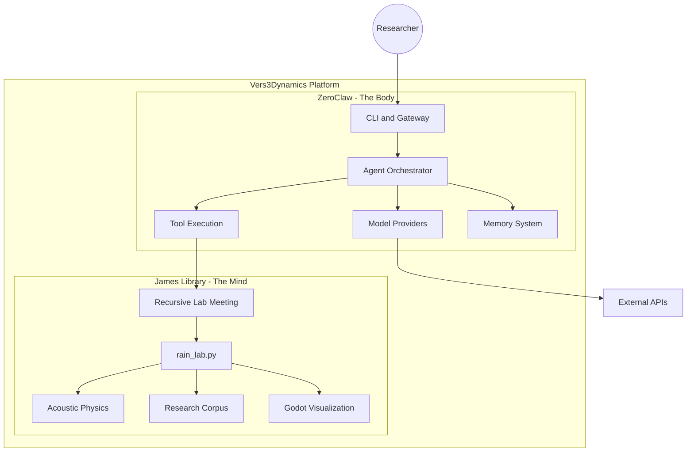

# Vers3Dynamics

<p align="center">
  
</p>

## Autonomous Acoustic Physics and Resonance Research Platform

<p align="center">
  <strong>
    Bridging autonomous AI agents with acoustic physics research through a unified Rust-first execution engine.
  </strong>
</p>

<p align="center">
  
  
  
  
</p>

---

## Mission

Vers3Dynamics R.A.I.N. Lab is an R&D platform for non-linear wave interactions and bio-acoustic phenomena.

The system combines:

- **ZeroClaw (The Body)**: Rust agent runtime for orchestration, tools, channels, and policy enforcement.
- **James Library (The Mind)**: Python research workflows for resonance, recursive meetings, and synthesis.

---

## Architecture



| Component | Role | Technology |
|-----------|------|------------|
| ZeroClaw | Autonomous runtime, tool orchestration, provider management | Rust |
| James Library | Research workflows, recursive reasoning, synthesis | Python |
| Godot Client | Multi-agent visual interface | GDScript |

---

## Quick Start

### Prerequisites

- Rust 1.87+
- Python 3.10+
- Optional: Miniconda for Python env management

### Full Setup

```bash
git clone https://github.com/topherchris420/james_library.git
cd james_library

python -m venv .venv
source .venv/bin/activate  # On Windows: .venv\Scripts\activate
pip install -r requirements.txt

cargo build --release
```

### Python Research Only

```bash
python rain_lab.py --mode first-run
python rain_lab.py --mode chat --topic "your research question"
python rain_lab.py --mode rlm --topic "acoustic resonance phenomena"
```

### Windows Installer

```text
1) Double-click INSTALL_RAIN.cmd
2) Wait for install to finish
3) Launch R.A.I.N. Lab Chat from Desktop or Start Menu
```

---

## Project Structure

```text
james_library/
|-- src/                      # ZeroClaw Rust source
|   |-- agent/
|   |-- channels/
|   |-- gateway/
|   |-- memory/
|   |-- providers/
|   |-- runtime/
|   `-- tools/
|-- tests/                    # Rust and Python tests
|-- benches/                  # Criterion benchmarks
|-- scripts/ci/               # CI guard scripts
|-- james_library/            # Python research modules
|-- rain_lab.py               # Main Python launcher
|-- config.example.toml       # Config template
|-- Cargo.toml                # Rust workspace manifest
`-- pyproject.toml            # Python lint/type/test config
```

---

## Reliability Guardrails

- **Repo integrity guard**: `scripts/ci/repo_integrity_guard.py`
  - Fails if duplicate `src/src` tree appears.
  - Fails if embedded dashboard fallback is missing (`build.rs` or `web/dist/index.html`).
- **Embedded dashboard fallback**: `build.rs` auto-creates `web/dist/index.html` if frontend artifacts are absent.
- **Gateway request-path hardening**:
  - Reduced allocation pressure in static serving path.
  - Stricter asset path validation.
  - More efficient rate limiting and idempotency cleanup behavior.

---

## Development

### Python

```bash
pip install -r requirements-dev.txt
ruff check .
pytest -q
```

### Rust

```bash
cargo fmt --all
cargo clippy --all-targets -- -D warnings
cargo test
cargo check
```

### Benchmarks

```bash
cargo bench --features benchmarks --bench agent_benchmarks
```

---

## Godot Integration

```bash
python rain_lab.py --mode chat --ui auto --topic "your topic"
python rain_lab.py --mode chat --ui on --topic "your topic"
```

`--ui auto` starts avatars when Godot is available and falls back to CLI when not.

---

## Documentation

- [ARCHITECTURE.md](ARCHITECTURE.md)
- [PRODUCT_ROADMAP.md](PRODUCT_ROADMAP.md)
- [CONTRIBUTING.md](CONTRIBUTING.md)
- [SECURITY.md](SECURITY.md)
- [docs/PRODUCTION_READINESS.md](docs/PRODUCTION_READINESS.md)

---

## License

MIT License. See [LICENSE](LICENSE).
