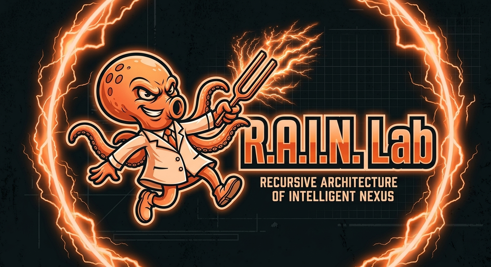

# 🐙R.A.I.N. Lab

**A private-by-default expert panel in a box for researchers, independent thinkers, and R&D teams.**

Ask a raw research question. The R.A.I.N. Lab assembles multiple expert perspectives, grounds strong claims in papers or explicit evidence, and returns the strongest explanations, disagreements, and next moves.

Most tools help you find papers. R.A.I.N. Lab helps you think with a room full of experts.

James is the assistant inside the R.A.I.N. Lab.

<p align="center">
  
</p>

<p align="center">🌐
  <a href="README.zh-CN.md">简体中文</a> •
  <a href="README.ja.md">日本語</a> •
  <a href="README.ru.md">Русский</a> •
  <a href="README.fr.md">Français</a> •
  <a href="README.vi.md">Tiếng Việt</a>
</p>

---

## What It Does

The R.A.I.N. Lab turns one question into a structured research conversation.

- It frames the problem from multiple expert angles.
- It separates strong evidence from weak speculation.
- It shows agreements, disagreements, and open questions instead of forcing false certainty.
- It helps you decide what to read next, test next, or ask next.

This is built for work that starts messy: early-stage research, technical due diligence, strategy exploration, independent investigation, and R&D planning.

---

## Try It Now

### Public Web Experience

Start with the example hosted experience:

- [Here](https://rainlabteam.vercel.app/)

If you want the fastest way to feel the product, start there first.

### Local and Private

Run the local experience on your own machine:

```bash
python rain_lab.py
```

Press Enter for demo mode, or continue into guided setup.

On Windows, you can also double-click `INSTALL_RAIN.cmd` to create shortcuts.
On macOS/Linux, run `./install.sh` for a one-click setup.

---

## Who It Is For

- Researchers working through ambiguous questions
- Independent thinkers building evidence-backed views
- R&D teams comparing explanations, risks, and next moves
- Technical operators who want private workflows and inspectable reasoning

---

## What You Can Do

| Use case | What R.A.I.N. Lab helps you do |
|----------|--------------------------------|
| **Pressure-test a research claim** | Compare competing explanations and inspect where the evidence is thin |
| **Map a new topic fast** | Turn a vague question into viewpoints, sources, disagreements, and next steps |
| **Prepare decisions** | Surface trade-offs, unresolved risks, and what would change the conclusion |
| **Stay private** | Keep your local workflow and model setup on your own machine when needed |

---

## Why It Is Different

Most research tools optimize for retrieval. R.A.I.N. Lab is designed for synthesis, challenge, and judgment.

| Typical tool behavior | R.A.I.N. Lab behavior |
|-----------------------|-----------------------|
| Returns a list of papers or links | Returns competing interpretations and strongest next moves |
| Treats the first plausible answer as good enough | Preserves disagreements and uncertainty where it matters |
| Hides reasoning behind one-shot summaries | Makes evidence, gaps, and confidence easier to inspect |
| Assumes cloud-first workflows | Supports local and private usage paths |

---

## Local and Private Workflow

If you want the product to run from your machine with your own setup:

1. Launch the app:

```bash
python rain_lab.py
```

2. For guided setup, run:

```bash
python rain_lab.py --mode first-run
```

3. For a first structured prompt, try:

```bash
python rain_lab.py --mode beginner --topic "compare the strongest arguments for and against a local-first research workflow"
```

The guided flow can connect to LM Studio or Ollama so your model traffic stays local.

---

## See It In Action

Ask a research question. Watch four expert agents — James (lead scientist), Jasmine (post-doc), Luca (geometer), and Elena (logician) — debate it in real time.

```
TOPIC: Could a "Phononic Morphogenetic Field" — precise acoustic interference patterns
guiding matter assembly like DNA guides cell growth — actually work?

**James:** ...phononic frequency combs could act like an acoustic blueprint for
molecular organization. The missing link between quantum coherence and biological
assembly?

**Jasmine:** Hold on. Cymatic patterns are *static* — they don't adapt to errors
or material changes the way DNA does. And the energy density needed exceeds
current acoustic levitation by *orders of magnitude*. Where's the thermal
dissipation analysis?

**Luca:** The geometry is compelling, though. Wavelength spacing in phononic
combs (ωₙ₊₁ - ωₙ = 2πc/λ) parallels scalar field gradients in relic field
tomography. But macroscopic assembly requires E > 10⁴⁵ J — far beyond reach.

**Elena:** The math is elegant, but the premise has a fatal flaw. The energy
density violates the Landauer limit by multiple orders of magnitude. Current
systems operate ~10³ times lower. Without experimental validation at that
scale, this remains speculation.

[Meeting continues — James responds, Jasmine pushes back, consensus forms...]
```

Join a research meeting, explore disagreements, and leave with next steps — not just links.

## Features

- Multi-perspective research synthesis
- Evidence-aware reasoning with explicit uncertainty
- Guided next steps for reading, testing, and follow-up questions
- Private local workflow options
- Available in 6 languages: 中文, 日本語, Русский, Français, Tiếng Việt, English

---

## Requirements

- **Python 3.10+**
- **Optional:** LM Studio or Ollama for local AI models
- **Optional:** ZeroClaw/Rust toolchain for the fast runtime layer

Python works without the optional pieces. Adding them expands the local/private path.

---

## Documentation

- [Start Here](START_HERE.md)
- [Beginner Guide](docs/getting-started/README.md)
- [One-Click Install](docs/one-click-bootstrap.md)
- [Troubleshooting](docs/troubleshooting.md)
- [Research Papers](https://topherchris420.github.io/research/)

---

## For Developers

<details>
<summary>Click to expand</summary>

If you want to contribute to R.A.I.N. Lab or run the developer setup locally:

```bash
git clone https://github.com/topherchris420/james_library.git
cd james_library

# Python setup
uv python install 3.12
uv venv .venv --python 3.12
uv pip sync --python .venv/bin/python requirements-dev-pinned.txt

# Rust setup (optional, for the fast runtime layer)
cargo build --release --locked

# Run
uv run --python .venv/bin/python rain_lab.py --mode first-run
```

Recommended mental model:

- R.A.I.N. Lab is the experience.
- James is the assistant you interact with inside the lab.
- Python handles launcher flows and orchestration.
- ZeroClaw/Rust handles the fast runtime, tool surface, and lower-level infrastructure.

**Testing:**

```bash
ruff check .
pytest -q
cargo fmt --all
cargo clippy --all-targets -- -D warnings
```

See [ARCHITECTURE.md](ARCHITECTURE.md) and [CONTRIBUTING.md](CONTRIBUTING.md) for contributor details.

</details>

---

## License

MIT. Built by [Vers3Dynamics](https://vers3dynamics.com/), special thanks to ZeroClaw.

<a href="https://star-history.com/#topherchris420/james_library&type=date">
  
</a>
