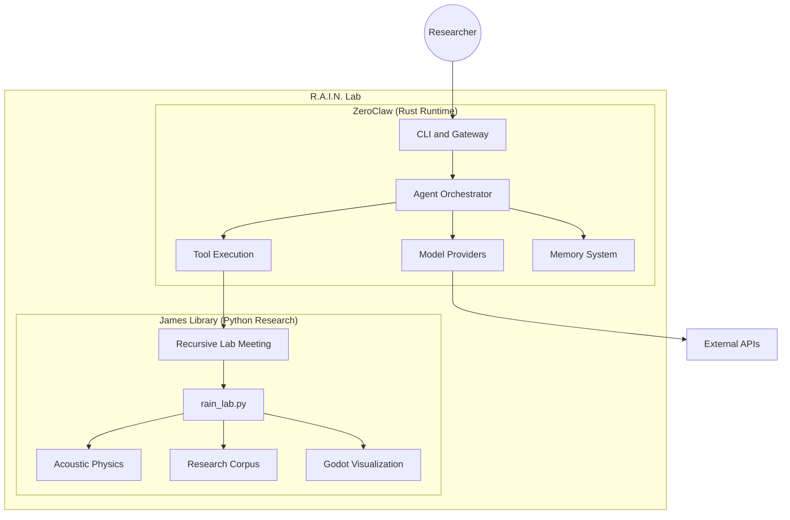

---
hide:
  - navigation
  - toc
hero:
  title: The R.A.I.N. Lab Documentation
  subtitle: The official technical reference for the enterprise-grade epistemic laboratory and multi-agent architecture.
  actions:
    - name: System Architecture
      link: ARCHITECTURE/
      icon: material/cpu-64-bit
    - name: Back to Main Site
      link: https://rainlabteam.vercel.app/
      icon: material/arrow-left
---

# James

<p align="center">
  
</p>

<p align="center">
  <strong>Your personal AI research assistants — talk about ideas, verify discoveries, and organize your work.</strong>
</p>

<p align="center">
  
  
  
  
</p>

<p align="center">
  <a href="https://deepwiki.com/topherchris420/james_library"></a>
</p>

<p align="center">
  <strong>Read this in:</strong>
  <a href="README.zh-CN.md">中文</a> ·
  <a href="README.ja.md">日本語</a> ·
  <a href="README.ru.md">Русский</a> ·
  <a href="README.fr.md">Français</a> ·
  <a href="README.vi.md">Tiếng Việt</a>
</p>

---

## Project Identity (Quick Map)

To avoid naming confusion, use this quick map:

- **R.A.I.N. Lab** = the end-user product experience
- **James Library** = the Python research/workflow layer
- **ZeroClaw** = the Rust runtime layer (`zeroclaw` crate)

Runtime flow at a glance:

`User -> R.A.I.N. Lab interface -> ZeroClaw runtime (agent/channels/tools/memory/security) -> James Library research workflows -> model/provider APIs`

---

## What is the R.A.I.N. Lab?

Vers3Dynamics' R.A.I.N. Lab are recursive AI research assistants that helps you explore ideas and make real discoveries. Unlike a regular chatbot that might "discover" things you already know, R.A.I.N. Lab cross-checks your internal knowledge and online sources to make sure you are exploring genuinely new territory.

**What you can do with it:**

- Have guided research conversations about any topic
- Run structured "lab meetings" where multiple AI agents debate and refine your ideas
- Automatically check whether a finding is novel or already known
- Organize and synthesize your research notes

**Who it is for:** Researchers, students, hobbyists, and anyone curious about physics, sound, engineering, or any complex topic. No programming experience is required to use it.

---

## Install in 3 Steps

The R.A.I.N. Lab runs on **Windows**, **macOS**, and **Linux**. Pick your platform below and follow the steps.

> **What you will need before you start:**
>
> - An internet connection (to download the project)
> - About 1 GB of free disk space
> - **Python 3.10 or newer** (the install guide below shows you how to get it)

---

### Windows

<details>
<summary><strong>Click to expand Windows setup instructions</strong></summary>

#### Step 1 — Install Python (if you do not have it)

1. Open your web browser and go to [python.org/downloads](https://www.python.org/downloads/).
2. Click the big yellow **"Download Python 3.x.x"** button.
3. Run the installer. **Important:** Check the box that says **"Add python.exe to PATH"** at the bottom of the first screen, then click **Install Now**.
4. When the install finishes, close the installer.

To verify it worked, open **Command Prompt** (search for "cmd" in the Start menu) and type:

```
python --version
```

You should see something like `Python 3.12.x`. If you see an error, restart your computer and try again.

#### Step 2 — Download R.A.I.N. Lab

**Option A — One-click download (easiest):**

1. Go to the [Releases page](https://github.com/topherchris420/james_library/releases).
2. Download the latest `.zip` file for Windows.
3. Right-click the downloaded file and choose **Extract All**.
4. Open the extracted folder.

**Option B — Using Git (if you have it):**

Open Command Prompt and run:

```
git clone https://github.com/topherchris420/james_library.git
cd james_library
```

#### Step 3 — Run the installer

Double-click **`INSTALL_RAIN.cmd`** in the project folder. This will:

- Create a virtual environment with all dependencies
- Run a preflight check to make sure everything works
- Add shortcuts to your Desktop and Start Menu

Once it finishes, double-click the **"R.A.I.N. Lab Chat"** shortcut on your Desktop to start chatting.

**Alternatively**, open Command Prompt in the project folder and run:

```
python bootstrap_local.py
python rain_lab.py
```

</details>

---

### macOS

<details>
<summary><strong>Click to expand macOS setup instructions</strong></summary>

#### Step 1 — Install Python (if you do not have it)

macOS comes with an older version of Python. You need Python 3.10 or newer.

**Easiest method — use the official installer:**

1. Go to [python.org/downloads/macos](https://www.python.org/downloads/macos/).
2. Download the latest macOS installer (`.pkg` file).
3. Double-click the file and follow the prompts.

**Alternative — use Homebrew (if you already have it):**

```bash
brew install python
```

To verify it worked, open **Terminal** (search for "Terminal" in Spotlight) and type:

```bash
python3 --version
```

You should see `Python 3.10.x` or newer.

#### Step 2 — Download R.A.I.N. Lab

Open Terminal and run:

```bash
git clone https://github.com/topherchris420/james_library.git
cd james_library
```

> If you do not have `git`, macOS will prompt you to install the Command Line Tools. Click **Install** and wait for it to finish, then run the commands above again.

#### Step 3 — Set up and launch

```bash
python3 bootstrap_local.py
python3 rain_lab.py
```

The interactive wizard will walk you through first-time setup and start a chat session.

</details>

---

### Linux

<details>
<summary><strong>Click to expand Linux setup instructions</strong></summary>

#### Step 1 — Install Python (if you do not have it)

Most Linux distributions include Python. Check your version:

```bash
python3 --version
```

If you see `Python 3.10.x` or newer, skip to Step 2. Otherwise, install it:

**Ubuntu / Debian:**

```bash
sudo apt update
sudo apt install python3 python3-venv python3-pip git
```

**Fedora:**

```bash
sudo dnf install python3 python3-pip git
```

**Arch Linux:**

```bash
sudo pacman -S python python-pip git
```

#### Step 2 — Download R.A.I.N. Lab

```bash
git clone https://github.com/topherchris420/james_library.git
cd james_library
```

#### Step 3 — Set up and launch

```bash
python3 bootstrap_local.py
python3 rain_lab.py
```

The interactive wizard will walk you through first-time setup and start a chat session.

</details>

---

## Using R.A.I.N. Lab

Once installed, here are the most common things you can do:

| What you want to do | Command |
|---|---|
| **Start chatting** (recommended first step) | `python rain_lab.py` |
| **Guided first-time setup** | `python rain_lab.py --mode first-run` |
| **Chat about a specific topic** | `python rain_lab.py --mode chat --topic "your research topic"` |
| **Run a lab meeting** (multi-agent debate) | `python rain_lab.py --mode rlm` |
| **Check if everything is working** | `python rain_lab.py --mode validate` |
| **See detected AI models** | `python rain_lab.py --mode models` |
| **Health check** | `python rain_lab.py --mode health` |

> **Tip:** On macOS and Linux, use `python3` instead of `python` if `python` is not recognized.

---

## Connecting an AI Model

R.A.I.N. Lab needs an AI model to power its conversations. The easiest option is **LM Studio**, which lets you run models locally on your own computer for free:

1. Download [LM Studio](https://lmstudio.ai/) for your platform.
2. Open LM Studio, search for a model (try "qwen2.5-coder:7b" for a good starting point), and download it.
3. Click **Start Server** in LM Studio.
4. Run `python rain_lab.py --mode first-run` — it will automatically detect LM Studio.

You can also use cloud providers (OpenRouter, OpenAI, etc.) by adding your API key during first-run setup.

---

## Troubleshooting

| Problem | Solution |
|---|---|
| `python` is not recognized | Make sure Python is installed and added to PATH. On macOS/Linux, try `python3` instead. |
| Permission denied on macOS/Linux | Run `chmod +x scripts/bootstrap.sh` and try again. |
| Install fails with "No module named venv" | Install the venv module: `sudo apt install python3-venv` (Ubuntu/Debian). |
| LM Studio not detected | Make sure LM Studio's server is running (click **Start Server** in LM Studio). |
| Something else is wrong | Run `python rain_lab.py --mode health` to see a diagnostic report. |

For more help, see [docs/troubleshooting.md](docs/troubleshooting.md) or [open an issue](https://github.com/topherchris420/james_library/issues).

---

## How It Works Under the Hood

This project ships as one product (**R.A.I.N. Lab**) built from two layers:

| Layer | What it does | Language |
|---|---|---|
| **James Library** | Research workflows — lab meetings, synthesis, acoustic physics | Python |
| **ZeroClaw** | Agent runtime — orchestration, tools, channels, memory, security | Rust (optional) |

You interact with R.A.I.N. Lab as a single product. The Python layer handles research workflows and delegates to the Rust runtime for fast orchestration when available. **Python research flows work without Rust installed** — the Rust runtime adds speed, channels, and tool execution for advanced users.


```mermaid
graph TB
    subgraph "R.A.I.N. Lab"
        subgraph "ZeroClaw (Rust Runtime)"
            CLI[CLI and Gateway]
            Agent[Agent Orchestrator]
            Providers[Model Providers]
            Tools[Tool Execution]
            Memory[Memory System]
        end

        subgraph "James Library (Python Research)"
            RLM[Recursive Lab Meeting]
            RainLab[rain_lab.py]
            Physics[Acoustic Physics]
            Research[Research Corpus]
            Godot[Godot Visualization]
        end
    end

    User((Researcher))
    External[External APIs]

    User --> CLI
    CLI --> Agent
    Agent --> Providers
    Agent --> Tools
    Agent --> Memory
    Tools --> RLM
    RLM --> RainLab
    RainLab --> Physics
    RainLab --> Research
    RainLab --> Godot
    Providers --> External
```

---

## Download Prebuilt Binaries

If you prefer not to install from source, download prebuilt binaries from the [Releases page](https://github.com/topherchris420/james_library/releases). See [docs/BINARY_RELEASES.md](docs/BINARY_RELEASES.md) for supported platforms and extraction steps.

---

## For Developers

<details>
<summary><strong>Click to expand developer setup and project structure</strong></summary>

### Prerequisites

- Python 3.10+ (required)
- Rust 1.87+ (recommended)
- LM Studio (recommended for local-first path)

### Full Setup

```bash
git clone https://github.com/topherchris420/james_library.git
cd james_library

python bootstrap_local.py
cargo build --release --locked    # optional — Python flows work without Rust
python rain_lab.py --mode first-run
```

### Project Structure

```text
james_library/
|-- src/                      # ZeroClaw Rust source
|   |-- agent/
|   |-- channels/
|   |-- gateway/
|   |-- memory/
|   |-- providers/
|   |-- runtime/
|   `-- tools/
|-- tests/                    # Rust and Python tests
|-- benches/                  # Criterion benchmarks
|-- scripts/ci/               # CI guard scripts
|-- james_library/            # Python research modules
|-- rain_lab.py               # Main Python launcher
|-- config.example.toml       # Config template
|-- Cargo.toml                # Rust workspace manifest
`-- pyproject.toml            # Python lint/type/test config
```

### Running Tests

**Python:**

```bash
pip install -r requirements-dev.txt
ruff check .
pytest -q
```

**Rust:**

```bash
cargo fmt --all
cargo clippy --all-targets -- -D warnings
cargo test
```

### Benchmarks

```bash
cargo bench --features benchmarks --bench agent_benchmarks
```

For a reproducible feature comparison against other research automation tools, see [`benchmark_data/`](benchmark_data/) and the reproduction script:

```bash
python scripts/benchmark/reproduce_readme_benchmark.py
```

### Godot Integration

```bash
python rain_lab.py --mode chat --ui auto --topic "your topic"
python rain_lab.py --mode chat --ui on --topic "your topic"
```

`--ui auto` starts avatars when Godot is available and falls back to CLI when not.

</details>

---

## Documentation

- [Architecture](ARCHITECTURE.md)
- [Product Roadmap](PRODUCT_ROADMAP.md)
- [Contributing Guide](CONTRIBUTING.md)
- [Security Policy](SECURITY.md)
- [Production Readiness](docs/PRODUCTION_READINESS.md)
- [First Run Checklist](docs/FIRST_RUN_CHECKLIST.md)
- [Binary Releases](docs/BINARY_RELEASES.md)

---

## License

MIT License. See [LICENSE](LICENSE).

## Acknowledgements

R.A.I.N. Lab is a [Vers3Dynamics](https://vers3dynamics.com/) project, built on the ZeroClaw runtime with inspiration from MIT CSAIL research. Huge thanks to both teams for creating such a high-performance, lightweight agent runtime that made this lab possible.

<picture>
  <source media="(prefers-color-scheme: dark)" srcset="https://api.star-history.com/svg?repos=topherchris420/james_library&type=Date&theme=dark&v=1">
  <source media="(prefers-color-scheme: light)" srcset="https://api.star-history.com/svg?repos=topherchris420/james_library&type=Date&v=1">
  
</picture>
