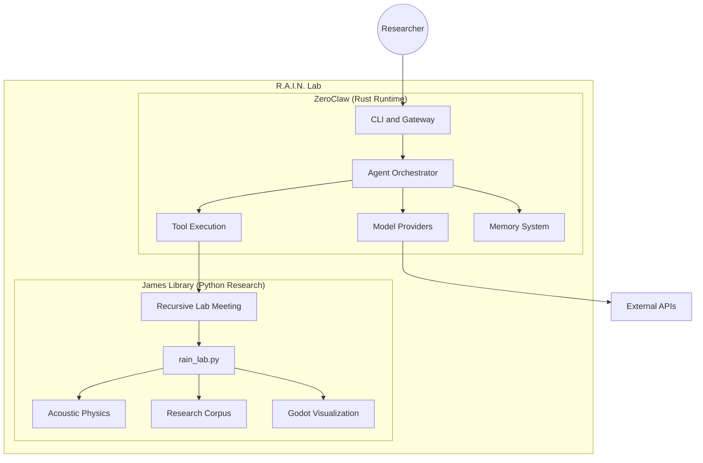

---
hide:
  - navigation
  - toc
hero:
  title: The R.A.I.N. Lab Documentation
  subtitle: The official technical reference for the enterprise-grade epistemic laboratory and multi-agent architecture.
  actions:
    - name: System Architecture
      link: ARCHITECTURE/
      icon: material/cpu-64-bit
    - name: Back to Main Site
      link: https://rainlabteam.vercel.app/
      icon: material/arrow-left
---

# R.A.I.N. Lab

<p align="center">
  
</p>

<p align="center">
  <strong>A local-first AI research workspace for guided chat, experiments, and autonomous research flows.</strong>
</p>

<p align="center">
  
  
  
  
</p>

<p align="center">
  <a href="https://deepwiki.com/topherchris420/james_library"></a>
</p>

R.A.I.N. Lab is an AI research assistant that talks with you about your ideas, checks if your discoveries are actually new, and helps organize your research. Regular AI can "discover" things you already know — R.A.I.N. Lab checks your internal knowledge and online sources to make sure you're exploring genuinely new territory.

**Best for:** Researchers, students, and curious minds exploring physics, sound, resonance, or any complex topic.

---

## How the Pieces Fit Together

This repository ships one product (**R.A.I.N. Lab**) built from two layers:

| Layer | What it does | Language | Entry point |
|-------|-------------|----------|-------------|
| **ZeroClaw** | Agent runtime — orchestration, tools, channels, memory, security | Rust | `zeroclaw` binary |
| **James Library** | Research workflows — recursive lab meetings, synthesis, acoustic physics | Python | `rain_lab.py` |

You interact with **R.A.I.N. Lab** as a single product. Under the hood, `rain_lab.py` drives the Python research layer and delegates to the ZeroClaw runtime for fast orchestration. Python research flows work standalone; the Rust runtime adds speed, channels, and tool execution.

---

## Quick Start

```bash
python rain_lab.py
```

The interactive wizard handles first-time setup, model detection, and chat. That's all you need.

For specific tasks:

```bash
python rain_lab.py --mode first-run     # guided setup
python rain_lab.py --mode chat --topic "your research topic"
python rain_lab.py --mode validate      # readiness check
python rain_lab.py --mode status        # environment + runtime status
python rain_lab.py --mode models        # detected models/providers
```

If Rust is not installed yet, core Python research flows still work.

---

## Architecture


```mermaid
graph TB
    subgraph "R.A.I.N. Lab"
        subgraph "ZeroClaw (Rust Runtime)"
            CLI[CLI and Gateway]
            Agent[Agent Orchestrator]
            Providers[Model Providers]
            Tools[Tool Execution]
            Memory[Memory System]
        end

        subgraph "James Library (Python Research)"
            RLM[Recursive Lab Meeting]
            RainLab[rain_lab.py]
            Physics[Acoustic Physics]
            Research[Research Corpus]
            Godot[Godot Visualization]
        end
    end

    User((Researcher))
    External[External APIs]

    User --> CLI
    CLI --> Agent
    Agent --> Providers
    Agent --> Tools
    Agent --> Memory
    Tools --> RLM
    RLM --> RainLab
    RainLab --> Physics
    RainLab --> Research
    RainLab --> Godot
    Providers --> External
```

| Component | Role | Technology |
|-----------|------|------------|
| ZeroClaw | Autonomous runtime, tool orchestration, provider management | Rust |
| James Library | Research workflows, recursive reasoning, synthesis | Python |
| Godot Client | Multi-agent visual interface | GDScript |

---

## Developer Setup

**Prerequisites:** Python 3.10+ (required), Rust 1.87+ (recommended), LM Studio (recommended for local-first path).

```bash
git clone https://github.com/topherchris420/james_library.git
cd james_library

python bootstrap_local.py
cargo build --release --locked    # optional — Python flows work without Rust
python rain_lab.py --mode first-run
```

Platform-specific bootstrap scripts are also available:

| Platform | Command |
|----------|---------|
| Linux/macOS | `bash scripts/quickstart_lmstudio.sh` |
| Windows (PowerShell) | `powershell -ExecutionPolicy Bypass -File .\scripts\quickstart_lmstudio.ps1` |
| Windows (one-click) | Double-click `INSTALL_RAIN.cmd` |

### All Launcher Modes

```bash
python rain_lab.py --mode first-run    # guided setup
python rain_lab.py --mode chat         # research conversation
python rain_lab.py --mode rlm          # recursive lab meeting
python rain_lab.py --mode validate     # readiness check
python rain_lab.py --mode status       # environment info
python rain_lab.py --mode models       # detected models
python rain_lab.py --mode providers    # configured providers
python rain_lab.py --mode health       # health snapshot
python rain_lab.py --mode gateway      # start gateway server
```

---

## Download Binaries

If you do not want to build from source, download prebuilt binaries from:

- https://github.com/topherchris420/james_library/releases

Supported release targets and extraction steps are documented in:

- [docs/BINARY_RELEASES.md](docs/BINARY_RELEASES.md)

---

## Project Structure

```text
james_library/
|-- src/                      # ZeroClaw Rust source
|   |-- agent/
|   |-- channels/
|   |-- gateway/
|   |-- memory/
|   |-- providers/
|   |-- runtime/
|   `-- tools/
|-- tests/                    # Rust and Python tests
|-- benches/                  # Criterion benchmarks
|-- scripts/ci/               # CI guard scripts
|-- james_library/            # Python research modules
|-- rain_lab.py               # Main Python launcher
|-- config.example.toml       # Config template
|-- Cargo.toml                # Rust workspace manifest
`-- pyproject.toml            # Python lint/type/test config
```

---

## Reliability Guardrails

- **Repo integrity guard**: `scripts/ci/repo_integrity_guard.py`
  - Fails if duplicate `src/src` tree appears.
  - Fails if embedded dashboard fallback is missing (`build.rs` or `web/dist/index.html`).
- **Embedded dashboard fallback**: `build.rs` auto-creates `web/dist/index.html` if frontend artifacts are absent.
- **Gateway request-path hardening**:
  - Reduced allocation pressure in static serving path.
  - Stricter asset path validation.
  - More efficient rate limiting and idempotency cleanup behavior.

---

## Development

### Python

```bash
pip install -r requirements-dev.txt
ruff check .
pytest -q
```

### Rust

```bash
cargo fmt --all
cargo clippy --all-targets -- -D warnings
cargo test
cargo check
```

### Benchmarks

```bash
cargo bench --features benchmarks --bench agent_benchmarks
```

---

## Godot Integration

```bash
python rain_lab.py --mode chat --ui auto --topic "your topic"
python rain_lab.py --mode chat --ui on --topic "your topic"
```

`--ui auto` starts avatars when Godot is available and falls back to CLI when not.

---

## Documentation

- [ARCHITECTURE.md](ARCHITECTURE.md)
- [PRODUCT_ROADMAP.md](PRODUCT_ROADMAP.md)
- [CONTRIBUTING.md](CONTRIBUTING.md)
- [SECURITY.md](SECURITY.md)
- [docs/PRODUCTION_READINESS.md](docs/PRODUCTION_READINESS.md)
- [docs/FIRST_RUN_CHECKLIST.md](docs/FIRST_RUN_CHECKLIST.md)
- [docs/BINARY_RELEASES.md](docs/BINARY_RELEASES.md)

---

## License

MIT License. See [LICENSE](LICENSE).

## Acknowledgements

R.A.I.N. Lab is a [Vers3Dynamics](https://rainlabteam.vercel.app/) project, built on the ZeroClaw runtime with inspiration from MIT CSAIL research. Huge thanks to both teams for creating such a high-performance, lightweight agent runtime that made this lab possible.

## Benchmarks

For a reproducible feature comparison against other research automation tools, see [`benchmark_data/`](benchmark_data/) and the reproduction script:

```bash
python scripts/benchmark/reproduce_readme_benchmark.py
```

<picture>
  <source media="(prefers-color-scheme: dark)" srcset="https://api.star-history.com/svg?repos=topherchris420/james_library&type=Date&theme=dark&v=1">
  <source media="(prefers-color-scheme: light)" srcset="https://api.star-history.com/svg?repos=topherchris420/james_library&type=Date&v=1">
  
</picture>
