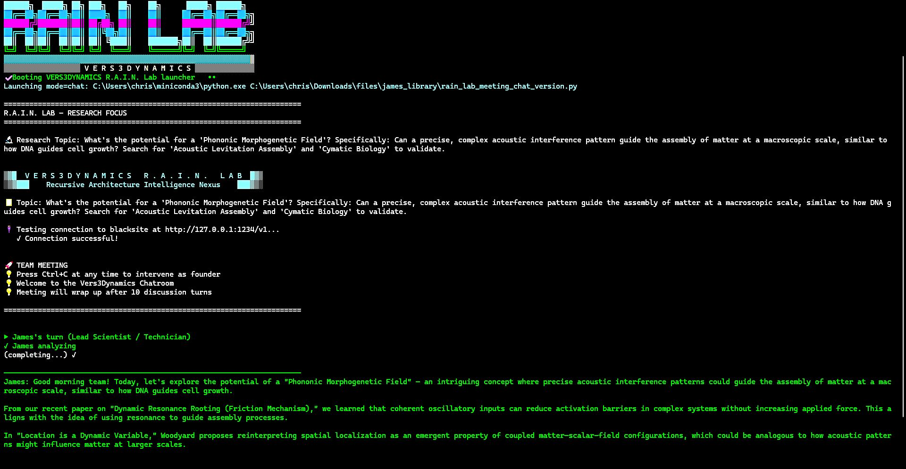

# R.A.I.N. Lab

**A research meeting in a box — four specialists who debate your question, challenge your assumptions, and tell you what to read next.**

R.A.I.N. Lab assembles James (lead scientist), Jasmine (hardware architect), Luca (geometer), and Elena (logician) around your research question. They don't all agree. That's the point.

<p align="center">
  
</p>

<p align="center">
  
</p>

---

## What It Does

Most tools find papers. R.A.I.N. Lab finds disagreements.

- It frames your question from four expert angles
- It surfaces where the evidence is weak and says so
- It shows you the strongest counter-argument to your best idea
- It ends with next moves, not just links

---

## See It In Action

> **TOPIC: Could acoustic interference patterns guide molecular assembly the way DNA guides cell growth?**

**James:** The frequency comb geometry you're describing — those spectral spacings match what I saw in the DRR paper. If the phononic field creates a standing wave at the right wavelength, you could theoretically anchor molecular complexes at node points. But that's a big "theoretically."

**Jasmine:** I love the ambition, but let's reality-check. Piezo actuators hit degradation limits around 100 kHz under continuous load. And thermal drift at sub-micron precision? Where's the energy budget?

**Luca:** The coherence depth function C_α(u) describes how deep pattern information persists in an oscillatory field. If the field is structured well enough, you don't need continuous high-frequency drive. The shape encodes the instructions.

**Elena:** Elegance doesn't satisfy Landauer's bound. The energy density required for your coherence depth at that spatial resolution is roughly 10⁴⁵ joules — a dozen orders of magnitude beyond what you're describing. verify_logic() on the combined constraints returns satisfiable, but satisfiable isn't plausible.

**James:** Next step is a targeted literature search on low-energy coherent phonon generation. Jasmine, pull real actuator specs and run the thermal numbers against Luca's geometry. I want a paper that either validates or kills this at the 10 µm scale.

<details>
<summary><b>Read the full exchange</b></summary>

**James:** Luca, the frequency comb geometry you're describing — those spectral spacings match what I saw in the DRR paper. If the phononic field creates a standing wave at the right wavelength, you could theoretically anchor molecular complexes at node points. But that's a big "theoretically."

**Jasmine:** Okay, pause. I love the ambition, but let's reality-check. Piezo actuators hit degradation limits around 100 kHz under continuous load. And thermal drift at sub-micron precision? We'd need active cooling loops that consume more power than the assembly process produces. Where's the energy budget?

**Luca:** Jasmine, you're right about the constraints — but watch the geometry. The coherence depth function C_α(u) describes how deep pattern information persists in an oscillatory field. If the field is structured well enough, you don't need continuous high-frequency drive. The self-organizing phase could do the work. The shape encodes the instructions.

**Elena:** Luca, I appreciate the elegance, but elegance doesn't satisfy Landauer's bound. The energy density required for your coherence depth at that spatial resolution is roughly 10⁴⁵ joules. That's a dozen orders of magnitude beyond what you're describing. James, the DRR paper — did it actually claim feasible energy scales, or was that extrapolation?

**James:** ...it was an extrapolation. The paper showed the scaling relationship, not the absolute numbers. Elena's right to flag that. The thermal management question is also open — the DRR model assumes heat dissipates linearly, but at those frequencies it doesn't.

**Jasmine:** So we're looking at a mechanism that might work in principle but needs experimental validation at scales we can't reach yet. That's not a technology. That's a hypothesis.

**Luca:** I disagree with the framing. A hypothesis with a clear geometry is further along than a vague intuition. We've narrowed the design space. The question now is whether the self-organizing phase can compensate for the power constraints Jasmine raised.

**Elena:** And the answer to that is: we don't know. verify_logic() on the combined constraints returns satisfiable — so it's not ruled out. But satisfiable isn't plausible.

**James:** Next step is probably a targeted literature search on low-energy coherent phonon generation. Jasmine, can you pull real actuator specs and run the thermal numbers against Luca's geometry? I want a paper that either validates or kills this at the 10 µm scale.

**Jasmine:** I can do that. Luca, send me the geometry parameters.

**Luca:** Will do.

</details>

---

## Meet the Agents

Each agent has a distinct voice, expertise, and set of constraints they bring to every question.

| Agent | Role | How They Think |
|-------|------|----------------|
| **James** | Lead Scientist | Draws from your research papers directly. Cites metrics. Says when data is missing. |
| **Jasmine** | Hardware Architect | Reality-checks everything against real material constraints. If it can't be built, she knows why. |
| **Luca** | Field Tomographer | Sees geometric patterns others miss. Makes intuitive leaps, then looks for the math to ground them. |
| **Elena** | Quantum Information Theorist | Demands formal rigor. Runs logical verification. Catches errors everyone else misses. |

Each agent's full personality, reasoning principles, and conversation style are defined in their **SOUL** file:

- [JAMES_SOUL.md](JAMES_SOUL.md) — Lead Scientist
- [JASMINE_SOUL.md](JASMINE_SOUL.md) — Hardware Architect
- [LUCA_SOUL.md](LUCA_SOUL.md) — Field Tomographer
- [ELENA_SOUL.md](ELENA_SOUL.md) — Quantum Information Theorist

The SOUL files are part of the product. They're what make the agents feel like colleagues, not search results.

---

## What You Can Do

| You want to... | R.A.I.N. Lab does this |
|----------------|------------------------|
| Pressure-test a claim | Four experts poke holes from different angles |
| Understand a new field | Get the landscape — agreements, open questions, what nobody agrees on |
| Decide what to read next | Leaves with specific paper recommendations and why they matter |
| Stress-test a research direction | Surfaces the strongest counter-argument before you invest months |
| Validate a stimulus against brain science | Run TRIBE v2 fMRI predictions on video, audio, or text |
| Keep your research private | Runs locally on your own models |

---

## Why It Works

| Typical research tool | R.A.I.N. Lab |
|-----------------------|---------------|
| Returns a list of papers | Returns a debate |
| Treats the first plausible answer as correct | Preserves disagreement until evidence resolves it |
| One perspective, one model | Four voices with different expertise and constraints |
| Cloud-first | Runs entirely local if you want |
| Says "here's what I found" | Says "here's what might be wrong with it" |

---

## Try It

**Live demo:** [rainlabteam.vercel.app](https://rainlabteam.vercel.app/) — no setup required

### Prerequisites

- Python 3.12+
- [uv](https://docs.astral.sh/uv/) (recommended) or pip
- Rust toolchain (optional, for the ZeroClaw runtime layer)
- A local model via [LM Studio](https://lmstudio.ai/) or [Ollama](https://ollama.com/) (optional — demo mode works without one)

### Install & Run

**macOS / Linux:**
```bash
./install.sh
python rain_lab.py
```

**Windows:**
```
Double-click INSTALL_RAIN.cmd
```

**From source (macOS / Linux):**
```bash
git clone https://github.com/topherchris420/james_library.git
cd james_library
uv python install 3.12
uv venv .venv --python 3.12
uv pip sync --python .venv/bin/python requirements-dev-pinned.txt
uv run --python .venv/bin/python rain_lab.py --mode first-run
```

**From source (Windows):**
```powershell
git clone https://github.com/topherchris420/james_library.git
cd james_library
uv python install 3.12
uv venv .venv --python 3.12
uv pip sync --python .venv\Scripts\python.exe requirements-dev-pinned.txt
uv run --python .venv\Scripts\python.exe rain_lab.py --mode first-run
```

Press Enter for demo mode, or connect to LM Studio / Ollama for full local operation.

---

## Think With Your Brain — Literally

R.A.I.N. Lab includes a **TRIBE v2 integration** that predicts fMRI brain activation patterns from video, audio, or text. Feed a stimulus to the model and James returns predicted cortical response maps — run basic neuroscience experiments from inside a research meeting.

- **Input:** video file, audio file, or raw text
- **Output:** predicted fMRI activation patterns across 20,484 cortical vertices
- **Use case:** validate whether a stimulus (image, sound, phrase) actually engages the brain regions your hypothesis claims

This is a real sidecar service (`tools/tribev2_sidecar/`) wrapping Facebook Research's TRIBE v2 model. Setup guide and API reference are in the sidecar README.

> **License: CC-BY-NC 4.0** — non-commercial use only.

---

<details>
<summary><b>For developers — architecture, extension points, contribution</b></summary>

### Architecture

R.A.I.N. Lab is a Rust-first autonomous agent runtime with a Python orchestration layer.

- `src/` — Rust core: trait-driven provider/channel/tool/peripheral system
- `crates/` — ZeroClaw runtime components
- `python/` — Python orchestration, RAIN Lab meeting logic, agent souls
- `agents.py` — Agent factory and delegation

### Extension Points

Extend by implementing traits and registering in factory modules:

- `src/providers/traits.rs` — Add a new model provider
- `src/channels/traits.rs` — Add a new messaging channel
- `src/tools/traits.rs` — Add a new tool
- `src/memory/traits.rs` — Add a memory backend
- `src/peripherals/traits.rs` — Add hardware board support

### Quality Checks

```bash
ruff check .
pytest -q
cargo fmt --all -- --check
cargo clippy --all-targets -- -D warnings
cargo test
```

### Design Principles

The codebase follows KISS, YAGNI, DRY (rule of three), SRP/ISP, fail-fast, secure-by-default, and reversible changes. See [ARCHITECTURE.md](ARCHITECTURE.md) and [CLAUDE.md](CLAUDE.md) for the full contract.

</details>

---

## Resources

| | |
|---|---|
| **Docs** | [Start Here](START_HERE.md) -- [Beginner Guide](docs/getting-started/README.md) -- [One-Click Install](docs/one-click-bootstrap.md) -- [Troubleshooting](docs/troubleshooting.md) |
| **Papers** | [Research Archive](https://topherchris420.github.io/research/) |
| **Language** | [简体中文](README.zh-CN.md) -- [日本語](README.ja.md) -- [Русский](README.ru.md) -- [Français](README.fr.md) -- [Tiếng Việt](README.vi.md) |

---

## Acknowledgments

Special thanks to the **ZeroClaw** team for the Rust runtime engine that powers R.A.I.N. Lab under the hood. The performance, stability, and extensibility of the agent runtime wouldn't be possible without their foundational work. See the `crates/` directory for ZeroClaw runtime components.

---

**License:** MIT -- [Vers3Dynamics](https://vers3dynamics.com/)
