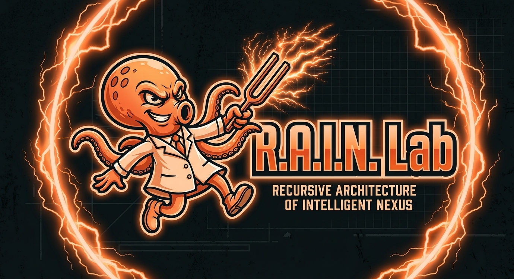
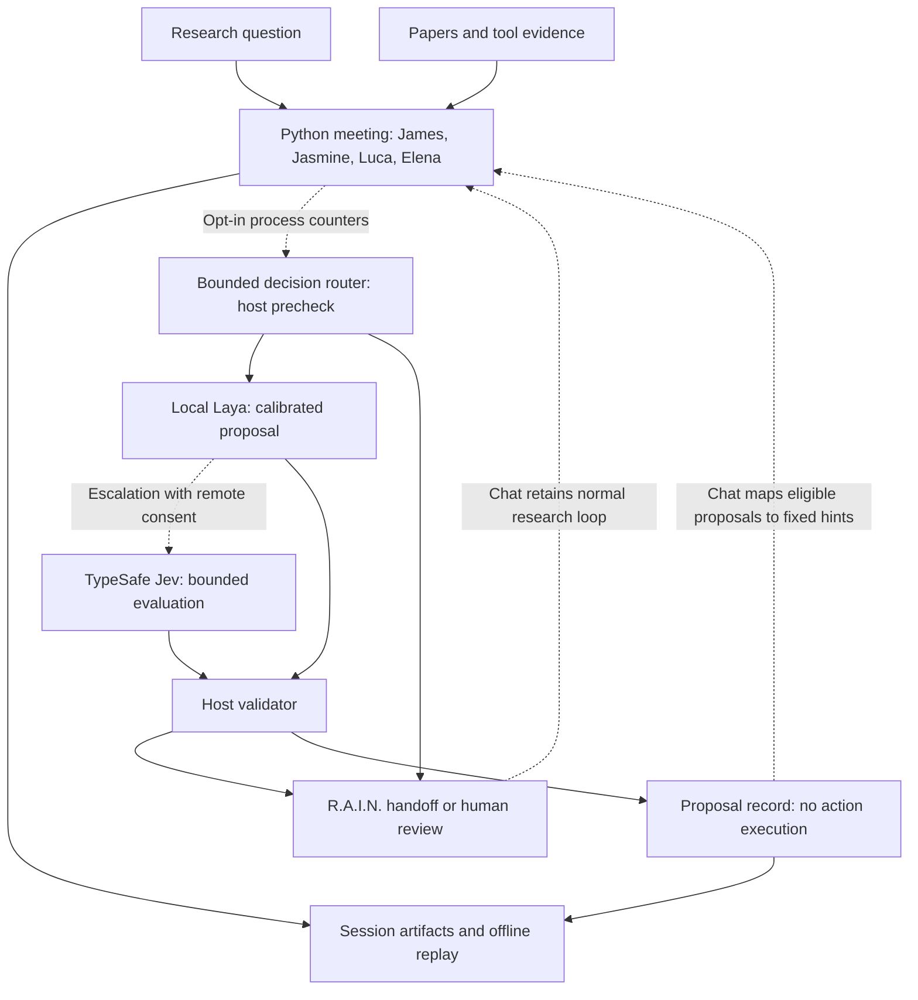
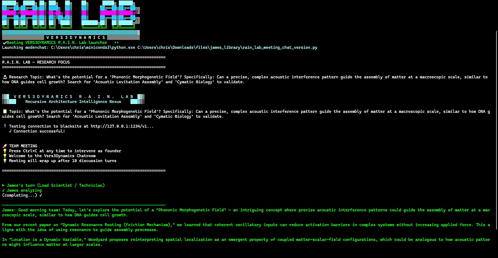
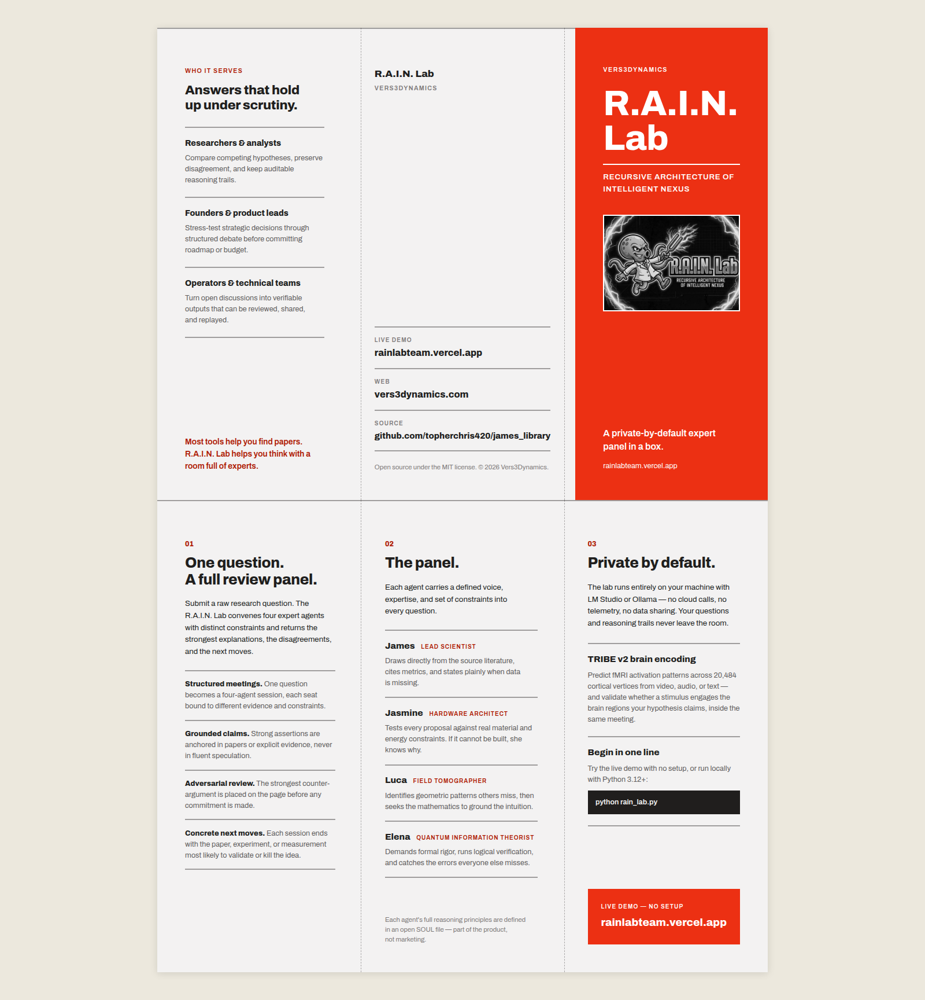

# R.A.I.N. Lab

**A private-by-default expert panel in a box for researchers, independent thinkers, and R&D teams.**

<p align="center">
  <a href="https://github.com/topherchris420/james_library/actions/workflows/ci.yml"></a>
  <a href="https://github.com/topherchris420/james_library/actions/workflows/tests.yml"></a>
  <a href="https://github.com/topherchris420/james_library/actions/workflows/deploy-docs.yml"></a>
  <a href="https://github.com/topherchris420/james_library/actions/workflows/sec-audit.yml"></a>
  <a href="LICENSE"></a>
</p>

<p align="center">
  
</p>

Ask a raw research question. The R.A.I.N. Lab assembles multiple expert
perspectives, grounds strong claims in papers or explicit evidence, and returns
the strongest explanations, disagreements, and next moves.

Most tools help you find papers. R.A.I.N. Lab helps you think with a room full of experts.

James is the assistant inside the R.A.I.N. Lab.

We separate generation, evidence, judgment, and authorization. James, Jasmine,
Luca, and Elena investigate; optional Laya and Jev providers propose bounded
decisions; host code checks policy and retains authority. Recorded artifacts
make decisions inspectable and replayable.

---

## Default Path

No setup: [rainlabteam.vercel.app](https://rainlabteam.vercel.app/)

Local start:

```bash
python rain_lab.py
```

That launcher is the stable product path. Hardware, messaging channels, web
deployment, TRIBE v2 sidecars, archive tooling, and provider-specific adapters
are opt-in extensions, not prerequisites for a first successful run.

For the maintainer boundary between core, extension, and experimental work, see
[`docs/project/product-boundary.md`](docs/project/product-boundary.md).

---

## What It Does

- Turns one research question into a four-agent meeting with distinct constraints
- Grounds strong claims in papers or explicit evidence instead of smooth talk
- Forces the strongest counter-argument onto the page before you commit to an idea
- Ends with concrete next moves, not just a stack of links

---

## Why It Is Different

| You need to... | Typical research tool | R.A.I.N. Lab |
|----------------|-----------------------|---------------|
| Pressure-test a claim | Surfaces papers that seem relevant and stops there | Has four agents attack the claim from evidence, hardware, geometry, and formal logic |
| Understand a new field | Gives you a search result page | Maps agreements, open questions, and where the literature still fights itself |
| Decide what to read next | Hands you a pile of citations | Ends with the paper, experiment, or measurement most likely to validate or kill the current idea |
| Validate a stimulus against brain science | Sends you into a separate neuroscience workflow | Runs TRIBE v2 on video, audio, or text inside the same research meeting |
| Keep the work private | Assumes a hosted stack | Supports local model inference with [LM Studio](https://lmstudio.ai/) or [Ollama](https://ollama.com/); hosted providers, web tools and Jev have separate network boundaries |

---

## Technical Architecture

The Python research meeting is the default entry point. The Rust runtime and
model-backed decision layers are optional extensions with separate boundaries.


```mermaid
flowchart TD
    Q["Research question"] --> M["Python meeting: James, Jasmine, Luca, Elena"]
    P["Papers and tool evidence"] --> M
    M --> A["Session artifacts and offline replay"]
    M -. "Opt-in process counters" .-> R["Bounded decision router: host precheck"]
    R --> L["Local Laya: calibrated proposal"]
    L -. "Escalation with remote consent" .-> J["TypeSafe Jev: bounded evaluation"]
    L --> V["Host validator"]
    J --> V
    R --> H["R.A.I.N. handoff or human review"]
    V --> H
    V --> D["Proposal record: no action execution"]
    D --> A
    D -. "Chat maps eligible proposals to fixed hints" .-> M
    H -. "Chat retains normal research loop" .-> M
```

| Layer | Implementation | Responsibility and boundary |
| --- | --- | --- |
| Research orchestration | [`rain_lab.py`](rain_lab.py), [`james_library/`](james_library/) | Launch meetings, gather evidence, preserve critique and session artifacts |
| Local judgment | [`laya.py`](james_library/judgment/laya.py), [`laya_worker.py`](james_library/judgment/laya_worker.py) | Evaluate explicit choices using a provisioned local checkpoint in a timeout-bounded worker |
| Independent remote judgment | [`typesafe.py`](james_library/judgment/typesafe.py) | Evaluate bounded state with Jev; external requests require opt-in configuration |
| Decision policy | [`routing.py`](james_library/judgment/routing.py), [`calibration.py`](james_library/judgment/calibration.py) | Check policy, calibration, uncertainty and consent; validate proposals or return a handoff |
| Claim promotion | [`gate.py`](james_library/judgment/gate.py) | Apply the separate fixed promotion policy to local validation and typed evidence |
| Runtime extensions | [`src/`](src/), [`crates/`](crates/) | Rust providers, channels, tools, security and satellite crates; not required for the Python meeting |

**Workflow proposals and claim promotion are separate paths.** The `decide`
command returns a proposal or handoff. The `judge` command accepts a curated
claim/evidence packet, checks formal and numerical validation status, obtains
optional independent Jev judgment, and records a deterministic disposition:
`PASS`, `REVISE`, `HUMAN_REVIEW`, or `UNAVAILABLE`. A peer score below the
threshold skips judgment. Laya routing does not replace that promotion gate.
A policy pass is not scientific proof or permission to execute arbitrary actions.

### Try the bounded decision interfaces

```bash
# Inspect a bounded request; routing remains off unless explicitly configured.
python rain_lab.py decide --request examples/bounded-decision.json

# Inspect a recorded decision without loading a model.
python rain_lab.py decide --replay path/to/session_decision.json

# Evaluate a caller-curated claim/evidence packet using the separate promotion path.
python rain_lab.py judge --evidence cycle.json
```

`cycle.json` is caller-supplied; its schema is in the
[typed judgment guide](docs/typed-judgment.md). The replay path is a placeholder
for a previously recorded artifact.

- Routing defaults to `RAIN_DECISION_MODE=off`; claim judgment defaults to
  `RAIN_JUDGMENT_PROVIDER=off`. Enabling one does not enable the other.
- Local Laya requires optional dependencies, an explicitly provisioned checkpoint,
  and matching calibration. No weights or production calibration profiles ship.
- Cascade routing calls Jev only with explicit remote consent. Missing calibration,
  invalid output, disagreement, or unresolved uncertainty produces a handoff.
- Chat process hints require `RAIN_METACOGNITIVE_CONTROL=true`; only curated
  counters enter that router. Models cannot change tools, permissions or budgets.
- Replay verifies recorded digests without inference. These digests are integrity
  checks, not digital signatures. Real-model accuracy and speed remain unmeasured.

See [calibrated bounded decisions](docs/bounded-decisions.md) for installation,
configuration, calibration, benchmarks and limitations.

---

## Meet the Agents

Each agent has a distinct voice, expertise, and set of constraints they bring to every question.

| Agent | Role | How They Think |
|-------|------|----------------|
| **James** | Lead Scientist | Draws from your research papers directly. Cites metrics. Says when data is missing. |
| **Jasmine** | Hardware Architect | Reality-checks everything against real material constraints. If it can't be built, she knows why. |
| **Luca** | Field Topographer | Sees geometric patterns others miss. Makes intuitive leaps, then looks for the math to ground them. |
| **Elena** | Quantum Information Theorist | Demands formal rigor. Runs logical verification. Catches errors everyone else misses. |

Each agent's full personality, reasoning principles, and conversation style are defined in their **SOUL** file:

- [JAMES_SOUL.md](JAMES_SOUL.md) — Lead Scientist
- [JASMINE_SOUL.md](JASMINE_SOUL.md) — Hardware Architect
- [LUCA_SOUL.md](LUCA_SOUL.md) — Field Topographer
- [ELENA_SOUL.md](ELENA_SOUL.md) — Quantum Information Theorist

The SOUL files are part of the product. They're what make the agents feel like colleagues, not search results.

---

## TRIBE v2 Brain Encoding

R.A.I.N. Lab includes a **TRIBE v2 integration** that predicts fMRI brain activation patterns from video, audio, or text. Feed a stimulus to the model and James returns predicted cortical response maps — letting you run basic neuroscience experiments from inside a research meeting.

| Capability | Detail |
|------------|--------|
| Input | video file, audio file, or raw text |
| Output | predicted fMRI activation patterns across 20,484 cortical vertices |
| Use case | explore model-predicted responses to a stimulus; predictions do not establish measured brain activation |
| Runtime | sidecar service in [`tools/tribev2_sidecar/`](tools/tribev2_sidecar/) wrapping Facebook Research's TRIBE v2 model |

Want to wire it into your own workflow? Read the [TRIBE v2 sidecar README](tools/tribev2_sidecar/README.md).

> **License: CC-BY-NC 4.0** — non-commercial use only.

---

## See It In Action

<p align="center">
  
</p>

> **TOPIC: Could acoustic interference patterns guide molecular assembly the way DNA guides cell growth?**

**James:** The frequency comb geometry you're describing — those spectral spacings match what I saw in the DRR paper. If the phononic field creates a standing wave at the right wavelength, you could theoretically anchor molecular complexes at node points. But that's a big "theoretically."

**Jasmine:** I love the ambition, but let's reality-check. Piezo actuators hit degradation limits around 100 kHz under continuous load. And thermal drift at sub-micron precision? Where's the energy budget?

**Luca:** The coherence depth function C_α(u) describes how deep pattern information persists in an oscillatory field. If the field is structured well enough, you don't need continuous high-frequency drive. The shape encodes the instructions.

**Elena:** Elegance doesn't satisfy Landauer's bound. The energy density required for your coherence depth at that spatial resolution is roughly 10⁴⁵ joules — a dozen orders of magnitude beyond what you're describing. verify_logic() on the combined constraints returns satisfiable, but satisfiable isn't plausible.

**James:** Next step is a targeted literature search on low-energy coherent phonon generation. Jasmine, pull real actuator specs and run the thermal numbers against Luca's geometry. I want a paper that either validates or kills this at the 10 µm scale.

<details>
<summary><b>Read the full exchange</b></summary>

**James:** Luca, the frequency comb geometry you're describing — those spectral spacings match what I saw in the DRR paper. If the phononic field creates a standing wave at the right wavelength, you could theoretically anchor molecular complexes at node points. But that's a big "theoretically."

**Jasmine:** Okay, pause. I love the ambition, but let's reality-check. Piezo actuators hit degradation limits around 100 kHz under continuous load. And thermal drift at sub-micron precision? We'd need active cooling loops that consume more power than the assembly process produces. Where's the energy budget?

**Luca:** Jasmine, you're right about the constraints — but watch the geometry. The coherence depth function C_α(u) describes how deep pattern information persists in an oscillatory field. If the field is structured well enough, you don't need continuous high-frequency drive. The self-organizing phase could do the work. The shape encodes the instructions.

**Elena:** Luca, I appreciate the elegance, but elegance doesn't satisfy Landauer's bound. The energy density required for your coherence depth at that spatial resolution is roughly 10⁴⁵ joules. That's a dozen orders of magnitude beyond what you're describing. James, the DRR paper — did it actually claim feasible energy scales, or was that extrapolation?

**James:** ...it was an extrapolation. The paper showed the scaling relationship, not the absolute numbers. Elena's right to flag that. The thermal management question is also open — the DRR model assumes heat dissipates linearly, but at those frequencies it doesn't.

**Jasmine:** So we're looking at a mechanism that might work in principle but needs experimental validation at scales we can't reach yet. That's not a technology. That's a hypothesis.

**Luca:** I disagree with the framing. A hypothesis with a clear geometry is further along than a vague intuition. We've narrowed the design space. The question now is whether the self-organizing phase can compensate for the power constraints Jasmine raised.

**Elena:** And the answer to that is: we don't know. verify_logic() on the combined constraints returns satisfiable — so it's not ruled out. But satisfiable isn't plausible.

**James:** Next step is probably a targeted literature search on low-energy coherent phonon generation. Jasmine, can you pull real actuator specs and run the thermal numbers against Luca's geometry? I want a paper that either validates or kills this at the 10 µm scale.

**Jasmine:** I can do that. Luca, send me the geometry parameters.

**Luca:** Will do.

</details>

---

## Try It Now

**Live demo:** [rainlabteam.vercel.app](https://rainlabteam.vercel.app/) — no setup required

**Requires:** Python 3.12+, [uv](https://docs.astral.sh/uv/) (recommended) or pip, and optionally a local model via [LM Studio](https://lmstudio.ai/) or [Ollama](https://ollama.com/). Rust is optional and only needed for the ZeroClaw runtime layer.

**On your machine:**

```bash
python rain_lab.py
```

Press Enter for the instant demo, or connect to LM Studio / Ollama for full local operation.

The instant demo is an offline research meeting over the papers in `papers/`. No
model runs. James, Jasmine, Luca and Elena argue from verbatim quotes, each
re-verified against the library with the same citation verifier the live
meeting uses. The meeting ends with a verdict, a next move and a citation audit.
When the library does not cover a question, the room says so instead of quoting
unrelated passages. Ask your own question with
`python rain_lab.py --mode demo --topic "..."`.

On Windows: double-click `INSTALL_RAIN.cmd` to create shortcuts.
On macOS/Linux: run `./install.sh`.

**From source (macOS / Linux):**
```bash
git clone https://github.com/topherchris420/james_library.git
cd james_library
uv python install 3.12
uv venv .venv --python 3.12
uv pip sync --python .venv/bin/python requirements-dev-pinned.txt
uv run --python .venv/bin/python rain_lab.py --mode first-run
```

**From source (Windows):**
```powershell
git clone https://github.com/topherchris420/james_library.git
cd james_library
uv python install 3.12
uv venv .venv --python 3.12
uv pip sync --python .venv\Scripts\python.exe requirements-dev-pinned.txt
uv run --python .venv\Scripts\python.exe rain_lab.py --mode first-run
```

---

## Who It Is For

R.A.I.N. Lab is built for people who need answers that hold up under scrutiny, not just answers that sound good.

| Role | What you can do with R.A.I.N. Lab |
|------|-----------------------------------|
| Researchers and analysts | Compare competing hypotheses, preserve disagreement, and keep auditable reasoning trails |
| Founders and product leads | Stress-test strategic decisions through structured debate before committing roadmap or budget |
| Operators and technical teams | Turn messy discussions into verifiable outputs that can be reviewed, shared, and replayed |

---

## Documentation

| | |
|---|---|
| **Docs** | [Start Here](START_HERE.md) -- [Beginner Guide](docs/getting-started/README.md) -- [One-Click Install](docs/one-click-bootstrap.md) -- [Troubleshooting](docs/troubleshooting.md) |
| **Papers** | [Research Archive](https://topherchris420.github.io/research/) |
| **Bounded decisions** | [Local Laya, optional Jev escalation, calibration and process hints](docs/bounded-decisions.md) |
| **Typed judgment** | [Independent bounded evaluation, deterministic policy, and replay](docs/typed-judgment.md) |
| **Handout** | [](assets/marketing/rain_lab_trifold.html) — [R.A.I.N. Lab Trifold](assets/marketing/rain_lab_trifold.html), printable one-pager overview |
| **Language** | [简体中文](README.zh-CN.md) -- [日本語](README.ja.md) -- [Русский](README.ru.md) -- [Français](README.fr.md) -- [Tiếng Việt](README.vi.md) |

---

## For Developers

<details>
<summary><b>Architecture, extension points, contribution</b></summary>

### Architecture

R.A.I.N. Lab is a Rust-first autonomous agent runtime with a Python orchestration layer.

- `rain_lab.py` — launcher. Chat meetings run `rain_lab_meeting_chat_version.py`; tool-exec meetings run `rain_lab_meeting.py`
- `james_library/` — Python package for session artifacts, eval, recovery, and the experiment protocol
- `agents.py` and `*_SOUL.md` — persona files. The chat meeting defines its own `Agent` class and does not import `agents.py`
- `src/` — Rust `rain` binary (package `rain-labs`): providers, channels, tools, security
- `crates/` — satellite crates (`logic_prover`, `rain-bench`, `robot-kit`, `buzz-agent`, `aardvark-sys`), not the meeting runtime
- `python/` — optional LangGraph tool package (`R.A.I.N.-tools`), not the meeting loop

### Extension Points

Extend by implementing traits and registering in factory modules:

- `src/providers/traits.rs` — Add a new model provider
- `src/channels/traits.rs` — Add a new messaging channel
- `src/tools/traits.rs` — Add a new tool
- `src/memory/traits.rs` — Add a memory backend
- `src/peripherals/traits.rs` — Add hardware board support
- `tools/tribev2_sidecar/server.py` — Extend TRIBE v2 sidecar serving and stimulus adapters

### Quality Checks

```bash
ruff check .
pytest -q
cargo fmt --all -- --check
cargo clippy --all-targets -- -D warnings
cargo test
```

### Security audit scope

[Sec Audit](https://github.com/topherchris420/james_library/actions/workflows/sec-audit.yml)
runs Rust dependency auditing and license/source checks on relevant pushes and
pull requests, weekly, and manually. Changes to the audit workflow and its
configuration also trigger these checks.

A green check means the configured policy passed, including documented exceptions
in [`.cargo/audit.toml`](.cargo/audit.toml) and [`deny.toml`](deny.toml). It does
not mean every dependency is vulnerability-free. In particular,
`RUSTSEC-2026-0292` remains excepted for the optional Matrix dependency chain;
the vulnerable dependency has not been patched by that exception. See the
configuration comments for the upgrade constraint and removal condition.

### Design Principles

The codebase follows KISS, YAGNI, DRY (rule of three), SRP/ISP, fail-fast, secure-by-default, and reversible changes. See [ARCHITECTURE.md](ARCHITECTURE.md) and [CLAUDE.md](CLAUDE.md) for the full contract.

### Contributing

See [CONTRIBUTING.md](CONTRIBUTING.md) for the branch/PR workflow and [SECURITY.md](SECURITY.md) for how to report vulnerabilities.

</details>

---

## Acknowledgments

The Rust runtime in `src/` (binary `rain`) descends from ZeroClaw. `crates/` holds satellite crates, not that runtime.

---

## License

**License:** MIT -- [Vers3Dynamics](https://vers3dynamics.com/)
