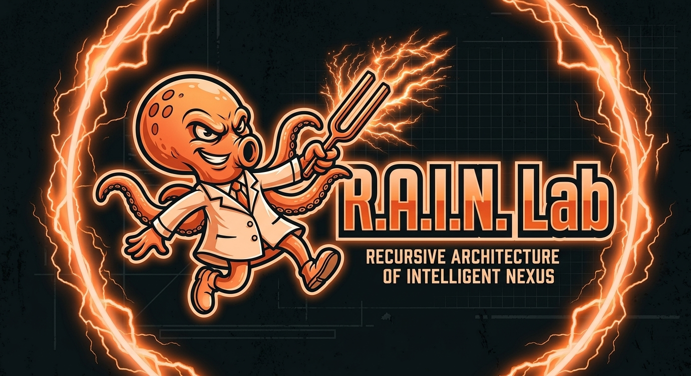
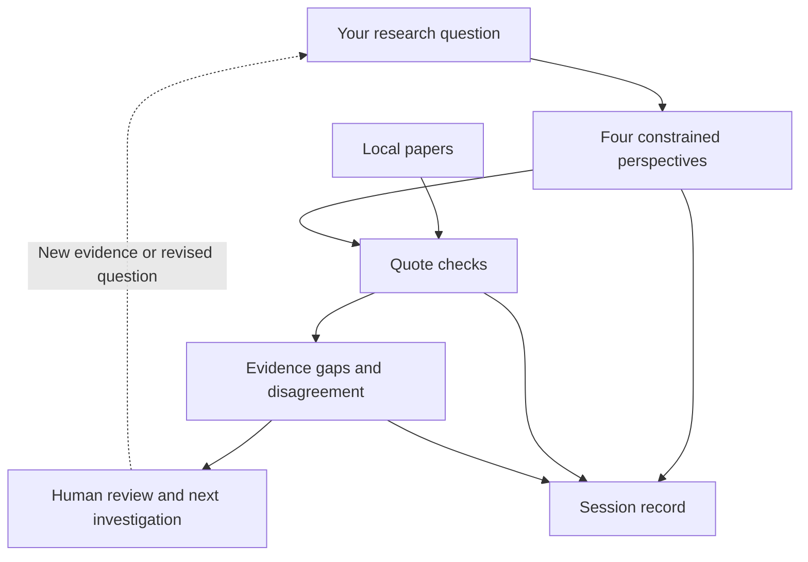

# R.A.I.N. Lab

**A local-first research environment where four constrained AI perspectives investigate a question, challenge one another, and leave an inspectable record.**

Think with a room that is allowed to disagree.

Bring a hypothesis, a difficult paper, or an idea that needs pressure-testing.
James, Jasmine, Luca, and Elena approach it through evidence, feasibility,
geometry, and formal reasoning. The useful outcome is a clearer account of
what is supported, what remains contested, and what to investigate next.

**[Try the browser interface](https://rainlabteam.vercel.app/)** · **[Run locally](#try-rain-lab)** · [See an example](#see-it-work) · [Documentation](docs/README.md)

[](https://github.com/topherchris420/james_library/actions/workflows/tests.yml)
[](LICENSE)

<p align="center">
  
</p>

The offline demo runs with Python alone. Live meetings need a configured model.
Laya, Jev, hardware, and neuroscience sidecars are optional. For private work,
use the local path and check the [network boundaries](#privacy-and-network-boundaries).

<a id="default-path"></a>
<a id="try-it-now"></a>

## Try R.A.I.N. Lab

### Local: the first meeting

With Git and Python 3.12+ installed:

```bash
git clone https://github.com/topherchris420/james_library.git
cd james_library
python rain_lab.py --mode demo
```

No model, API key, Rust build, or third-party Python packages are needed for
this demo. It retrieves passages from `papers/`, verifies each quote against
its source, and presents a **scripted** four-perspective discussion with a
verdict, disagreement, next move, and citation audit. It saves a transcript
and an HTML share card under `meeting_archives/`.

Ask your own question, or add `.md` and `.txt` papers to the corpus:

```bash
python rain_lab.py --mode demo --topic "Could acoustic interference patterns guide molecular assembly?"
```

Retrieval can be incomplete or irrelevant. A verified quote means the text
occurs in a source; it does not establish that the source is correct or that
it supports the proposed conclusion.

### Browser

Open [rainlabteam.vercel.app](https://rainlabteam.vercel.app/) to explore the
hosted interface. Hosted meetings depend on its backend and provider
availability; the offline local demo is the reproducible starting point.
Do not assume the hosted interface has the local workflow's privacy boundary.

### Live: connect a model

Use [one-click setup](docs/one-click-bootstrap.md): `INSTALL_RAIN.cmd` on
Windows or `./install.sh` on macOS/Linux. These installers download dependencies
and the prebuilt runtime. Then use the installed Python environment:

```bash
python rain_lab.py --mode first-run
python rain_lab.py --mode validate
python rain_lab.py --mode chat --topic "What evidence would falsify this hypothesis?"
```

`python rain_lab.py` opens the interactive launcher. Configure the endpoint
and model before live chat; for local-only work, also disable web search as
shown [below](#privacy-and-network-boundaries).

<details>
<summary>Manual Python setup (without the optional Rust runtime)</summary>

From the cloned repository, using [uv](https://docs.astral.sh/uv/):

```bash
uv python install 3.12
uv venv .venv --python 3.12
uv pip sync --python .venv/bin/python requirements-dev-pinned.txt
.venv/bin/python rain_lab.py --mode first-run
```

On Windows, replace `.venv/bin/python` with `.venv\Scripts\python.exe`.
Use that interpreter for subsequent commands, or activate `.venv` first.
The pinned development requirements include the core packages and test tools.

</details>

<a id="what-it-does"></a>

## What happens when you ask a question?

1. **Frame it.** Choose the question and the local papers to examine.
2. **Investigate from different constraints.** The four personas look for evidence, practical limits, structure, and logical objections.
3. **Ground and challenge.** Chat checks quoted spans against the citation corpus and marks turns without verified spans as ungrounded by default. Disagreement remains in the transcript.
4. **Choose the next investigation.** Look for a paper to read, an assumption to revise, or a measurement that could distinguish competing explanations. Review these proposals yourself.
5. **Keep the record.** Inspect the transcript and, for chat, structured session artifacts. Use separate optional gates when bounded judgment is needed.


```mermaid
flowchart TD
    Q["Your research question"] --> M["Four constrained perspectives"]
    P["Local papers"] --> C["Quote checks"]
    M --> C
    C --> D["Evidence gaps and disagreement"]
    D --> N["Human review and next investigation"]
    N -. "New evidence or revised question" .-> Q
    M --> A["Session record"]
    C --> A
    D --> A
```

This is a research process to inspect, not a guarantee that a generated answer
has been scientifically validated. Formal checks and typed claim promotion
are separate from ordinary chat.

<a id="see-it-in-action"></a>

## See it work

**Question:** “Could acoustic interference patterns guide molecular assembly?”

These short excerpts come from an offline demo run against the bundled corpus.
The surrounding dialogue is scripted; no model ran and no experiment was performed.

| Perspective | Excerpt from the run |
| --- | --- |
| **James — evidence** | “Nothing in the library touches 'guide', 'molecular' and 'assembly', so I'm scoping to what it covers.” |
| **Jasmine — feasibility** | “What none of these passages gives me is a cost and a tolerance, and without those I can't spec or price a build.” |
| **Luca — connection** | “Two papers, two framings, one shared idea: 'intelligence'.” |
| **Elena — challenge** | “Until something outside this library reproduces James's anchor, this is a well-instrumented hypothesis, not a result.” |

**Next move proposed by the demo:** investigate the test described in
`Integrated Plasma Confinement.md`, write down a failure condition first,
and quantify a cost before building. A human still needs to assess whether
that retrieved test addresses molecular assembly at all.

The run verified **6/6 quotes verbatim** and reported only partial topic coverage.
That is a citation audit, not six validated scientific claims. Run the command
above to read the complete exchange; results can change when the corpus changes.

<a id="why-it-is-different"></a>
<a id="who-it-is-for"></a>

## Why R.A.I.N.?

| Research need | What the Lab makes explicit |
| --- | --- |
| Examine a claim from more than one angle | Four personas with different constraints, rather than four interchangeable summaries. |
| Follow a citation back to its source | Verified quote spans and loaded-corpus file hashes in chat artifacts. Semantic support still needs review. |
| Preserve a useful objection | A transcript that retains disagreements instead of treating consensus as truth. |
| Decide what to investigate next | A discussion oriented toward missing evidence, counterarguments, and concrete follow-up work. |
| Inspect a decision later | Recorded turns, grounding metadata, and optional judgment/decision envelopes. |
| Control where context goes | Local model support, explicit remote-provider configuration, and separate bounded judgment inputs. |

<a id="meet-the-agents"></a>

## Meet the research panel

These are **prompt-defined perspectives**, not independent scientific authorities.
Their value is constraint diversity; sharing a model or corpus can still produce
shared blind spots.

| Agent | Constraint brought to the discussion | Definition |
| --- | --- | --- |
| **James** — lead assistant | Synthesize the research, identify supporting passages, and acknowledge missing evidence. | [James's SOUL](JAMES_SOUL.md) |
| **Jasmine** — hardware architect | Ask about materials, thermal limits, power, tolerances, and buildability. | [Jasmine's SOUL](JASMINE_SOUL.md) |
| **Luca** — field topographer | Explore geometry, topology, and cross-domain patterns that need testing. | [Luca's SOUL](LUCA_SOUL.md) |
| **Elena** — quantum information theorist | Challenge derivations, consistency, and information-theoretic assumptions. | [Elena's SOUL](ELENA_SOUL.md) |

SOUL files shape behavior. They do not establish the truth of their scientific
assertions or grant tools permissions beyond the selected runtime.

## How authority works

**Models propose. Host code checks. Humans decide what deserves to happen next.**

| Boundary | What it establishes |
| --- | --- |
| Generation | A hypothesis, critique, or proposed next step. Agent prose is not measured evidence. |
| Evidence | A source passage, tool result, simulation, or measurement, with its origin and limitations kept distinct. |
| Deterministic validation | Whether a specific schema, quote, formal constraint, numerical condition, or host policy passes its checks. |
| Bounded judgment | A model's typed assessment of curated input. It cannot override failed host validation. |
| Authorization | The host's action policy and required human approval, separate from model confidence. |

`decide` produces a proposal or handoff, never an executed action. Rig actions
have their own policy, validation, and authorization boundary. The optional
`rlm` tool-execution mode can execute Python; do not treat the judgment gate as
a universal sandbox or an approval wrapper around every runtime tool.

### Optional typed claim judgment

Package one claim with **caller-curated evidence and trusted validation results**.
With judgment enabled, Jev answers a fixed set of typed questions about support,
evidence quality, contradiction, scope, and human review. Ordinary host code
applies the disposition policy: `PASS`, `REVISE`, `HUMAN_REVIEW`, or `UNAVAILABLE`.

**PASS means the configured bounded policy was satisfied. It does not mean the scientific claim is true.**

The command consumes supplied validation results; it does not independently
repeat the experiment. Ordinary `chat` and `rlm` sessions do not automatically
produce this strict promotion record. With judgment disabled, the command
reports `DISABLED` and retains the existing peer-score gate; that is not a
successful Jev evaluation. See [typed judgment](docs/typed-judgment.md).

<a id="technical-architecture"></a>

## How R.A.I.N. is structured

**R.A.I.N. Lab** is the product. **James** is its lead assistant.
**James Library** is this repository and its Python workflow collection.

| Layer | Entry point and scope |
| --- | --- |
| Core research experience | [`rain_lab.py`](rain_lab.py) launches the offline demo or model-backed meetings. [`rain_lab_meeting_chat_version.py`](rain_lab_meeting_chat_version.py) implements chat, grounding, and session recording. |
| Optional workflow proposals | [`james_library/judgment/`](james_library/judgment/) routes bounded choices through local Laya and, with consent, remote Jev. Host prechecks and final validation retain authority. |
| Separate claim promotion | `judge --evidence` evaluates a curated packet under the fixed promotion policy. It is distinct from Laya workflow routing. |
| Runtime and extensions | [`src/`](src/) contains the Rust `rain` runtime: providers, tools, channels, security, and Rig. [`crates/`](crates/) contains satellite crates. No Rust build is needed for the offline demo or Python chat. |

### Optional Laya / Jev routing

Laya proposes locally from explicit choices; it needs optional dependencies,
a provisioned checkpoint, and matching calibration. In cascade mode, unresolved
cases can escalate to TypeSafe's remote Jev only with explicit consent.
Missing calibration, uncertainty, engine disagreement, or failed validation
produces a rejection or handoff rather than permission to act.

Routing defaults to `RAIN_DECISION_MODE=off`; claim judgment separately defaults
to `RAIN_JUDGMENT_PROVIDER=off`. Chat process hints additionally require
`RAIN_METACOGNITIVE_CONTROL=true`. No model weights or production calibration
profiles ship; real-model accuracy and speed are not established here.

<details>
<summary>Advanced commands — after Python dependency setup</summary>

```bash
python rain_lab.py decide --request examples/bounded-decision.json
```

With routing off, expect a `DISABLED` handoff and exit code 1, not an action.

```bash
python rain_lab.py judge --evidence cycle.json
```

`cycle.json` is a file you create using the
[evidence packet schema](docs/typed-judgment.md#evidence-packet).
Enable the provider intentionally before expecting typed evaluation.

```bash
python rain_lab.py decide --replay path/to/session_decision.json
python rain_lab.py judge --replay path/to/session_judgment.json
```

Replace those paths with recorded artifacts. Replay reads and checks the saved
record without loading a model. Setup, calibration, consent, and failure modes
are documented in [bounded decisions](docs/bounded-decisions.md).

</details>

## Recorded sessions and replay

The record is part of the result. Chat writes JSON artifacts under
`meeting_archives/session_artifacts/`: turns, verified evidence spans,
loaded-corpus hashes, grounding metadata, and session summaries. Optional
decisions and judgments occupy separate arrays, preserving their policy,
provider/model, disposition, and reason codes.

Use records to inspect sources, compare sessions, review unresolved objections,
and revisit a decision. [Recorded judgment/decision replay](docs/typed-judgment.md#flight-recorder-and-replay)
verifies saved digests without inference. The separate
[gold-session replay runner](james_library/utilities/session_replay.py)
can launch new chat runs for evaluation; it is not identical to offline record inspection.

Digests detect accidental or partial changes. They are **not digital signatures**,
proof of scientific correctness, or protection against someone rewriting both
the data and its digest. Re-running a generative meeting need not reproduce its words.

<a id="rain-rig"></a>
<a id="tribe-v2-brain-encoding"></a>

## Optional extensions

| Extension | What it adds | Boundary and setup |
| --- | --- | --- |
| **R.A.I.N. Rig** | A local node view of inference, transports, listeners, and hardware; `rain rig status`, `doctor`, and `setup`. | Optional runtime layer. No model downloads or new listeners merely from enabling the configuration. [Rig guide](docs/rig/README.md). |
| **TRIBE v2** | A neuroscience sidecar for video, audio, or text, returning summaries of model-predicted fMRI activation across 20,484 cortical vertices. | Predictions are not measured human brain activity. Separate weights/dependencies; TRIBE v2 is **CC-BY-NC 4.0**, non-commercial only. [Sidecar setup](tools/tribev2_sidecar/README.md). |
| **Channels and interfaces** | Messaging adapters, a web dashboard, and hosted meeting entry points. | Separate services, credentials, and network boundaries. [Channels](docs/channels-reference.md), [`web/`](web/), [`lab_server/`](lab_server/). |
| **Hardware and Skybridge** | Hardware interfaces and experimental low-bandwidth transport work. | Optional devices/builds. Skybridge is plaintext and RF transmit is compiled out by default. [Hardware](docs/hardware/README.md), [Skybridge](docs/rig/skybridge.md). |

## Privacy and network boundaries

The **offline demo** uses local files and no model calls. Live privacy depends
on configuration: the current chat defaults target a loopback Ollama endpoint
but select `minimax-m2.7:cloud`, and web search is enabled. A localhost address
alone does not make inference local.

For local inference, install dependencies, load a local model in Ollama or
LM Studio, and explicitly select it. This direct chat entry point also exposes
the search switch:

```bash
python rain_lab_meeting_chat_version.py --base-url http://127.0.0.1:11434/v1 --model YOUR_LOCAL_MODEL --no-web --topic "What evidence would falsify this hypothesis?"
```

Replace `YOUR_LOCAL_MODEL` with the actual loaded model ID; for LM Studio use
its configured endpoint. For an enforced hosted-inference refusal, see
[Rig privacy modes](docs/rig/README.md) and configure `[rig] privacy = "local"`
in the active runtime configuration. Disable web search separately.

Live meetings send selected research context to the configured model. Optional
remote **claim judgment** sends only allowlisted fields from the curated packet;
its builder does not read the library, transcript, or private memory. Optional
chat **process routing** uses curated counters rather than paper content.
Review packets before permitting remote processing. Local transcripts can also
contain private material; inspect them before sharing.

## What R.A.I.N. does not claim

- Agreement among personas establishes truth or independence.
- A citation match proves that a source supports a conclusion.
- A model judgment, `PASS`, or a satisfiable formula verifies a scientific theory.
- A simulation or predicted brain response is a physical measurement.
- Every mode passes through the same validation and human-approval gate.

These distinctions let you decide which parts of a result deserve further work.

<a id="documentation"></a>
<a id="for-developers"></a>

## Documentation and development

| Start here | Go deeper |
| --- | --- |
| [Documentation hub](docs/README.md) · [Full contents](docs/SUMMARY.md) | [Architecture](ARCHITECTURE.md) · [Core / extension boundary](docs/project/product-boundary.md) |
| [Beginner guide](docs/getting-started/README.md) · [Install](docs/one-click-bootstrap.md) | [Configuration](docs/config-reference.md) · [Providers](docs/providers-reference.md) · [Troubleshooting](docs/troubleshooting.md) |
| [Bounded decisions](docs/bounded-decisions.md) · [Typed judgment](docs/typed-judgment.md) | [Meeting recovery](docs/meeting-recovery.md) · [Rig architecture](docs/rig/architecture.md) |
| [Contributing](CONTRIBUTING.md) · [Security reporting](SECURITY.md) | [CI workflows](.github/workflows/README.md) · [Security documentation](docs/security/README.md) |

[简体中文](README.zh-CN.md) · [日本語](README.ja.md) · [Русский](README.ru.md) · [Français](README.fr.md) · [Tiếng Việt](README.vi.md)

<details>
<summary>Developer checks and security audit scope</summary>

After installing development dependencies, Python checks are `ruff check .`
and `pytest -q`. Rust changes use `cargo fmt --all -- --check`,
`cargo clippy --all-targets -- -D warnings`, and `cargo test` with the repository's
pinned toolchain. See the contribution guide for checks appropriate to your change.

[Security audit](https://github.com/topherchris420/james_library/actions/workflows/sec-audit.yml)
checks configured Rust dependency and license policies. A green result includes
the documented exceptions in [`.cargo/audit.toml`](.cargo/audit.toml) and
[`deny.toml`](deny.toml); it does not mean every dependency is vulnerability-free.
`RUSTSEC-2026-0292` remains excepted for the optional Matrix dependency chain.
That exception does not patch the vulnerability.

</details>

<a id="license"></a>
<a id="acknowledgments"></a>

## License and acknowledgments

[MIT](LICENSE) · [Vers3Dynamics](https://vers3dynamics.com/).
The Rust runtime descends from ZeroClaw. Optional third-party components retain
their own licenses, including TRIBE v2's non-commercial restriction.
