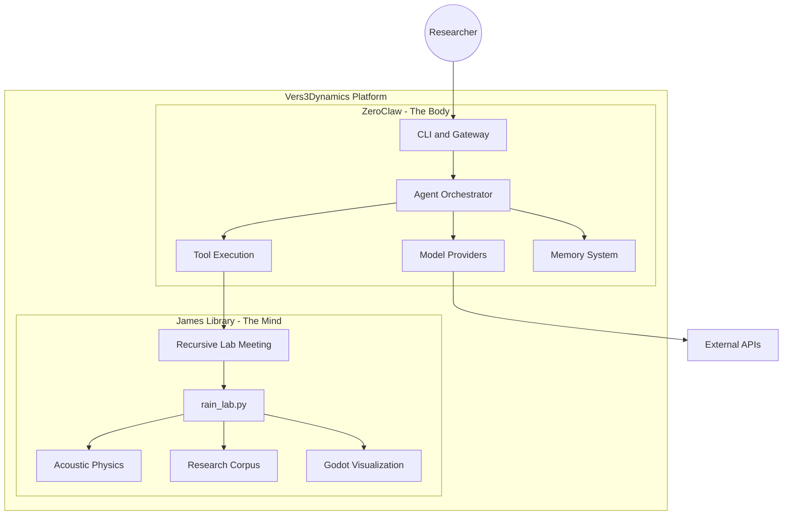
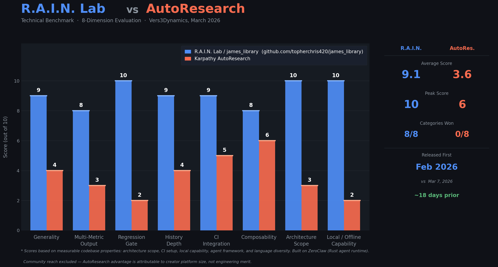
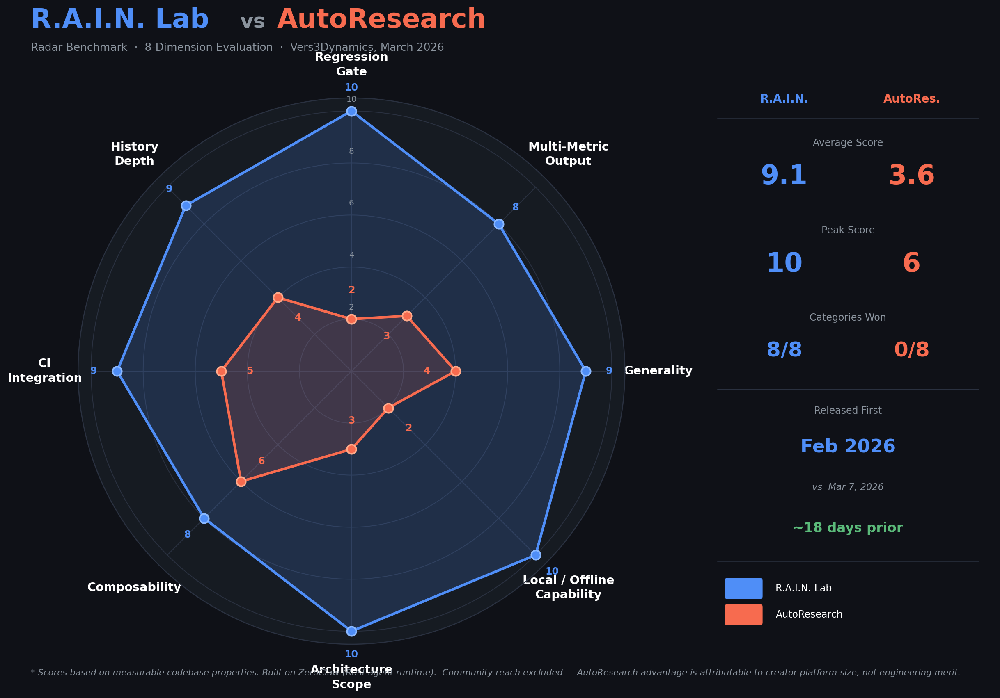

# Vers3Dynamics

<p align="center">
  
</p>

A lightweight framework for building modular AI systems,
experimental agent architectures, and research prototypes.

This is designed for researchers, builders, and experimental
AI developers who want a simple architecture for composing
agents, modules, and tools without heavyweight frameworks.

[](https://deepwiki.com/topherchris420/james_library)

## Autonomous Acoustic Physics and Resonance Research Platform

<p align="center">
  <strong>
    Bridging autonomous AI agents with acoustic physics research through a unified Rust-first execution engine.
  </strong>
</p>

<p align="center">
  
  
  
  
</p>

---

## Mission

Vers3Dynamics R.A.I.N. Lab🐙 is an R&D platform for non-linear wave interactions and bio-acoustic phenomena.

The system combines:

- **ZeroClaw (The Body)**: Rust agent runtime for orchestration, tools, channels, and policy enforcement.
- **James Library (The Mind)**: Python research workflows for resonance, recursive meetings, and synthesis.

---

## Architecture



| Component | Role | Technology |
|-----------|------|------------|
| ZeroClaw | Autonomous runtime, tool orchestration, provider management | Rust |
| James Library | Research workflows, recursive reasoning, synthesis | Python |
| Godot Client | Multi-agent visual interface | GDScript |

---

## Quick Start

### Prerequisites

- Python 3.10+ (required)
- LM Studio for the recommended local-first path
- Rust 1.87+ (recommended for local ZeroClaw builds and development)
- Optional: Miniconda for Python env management

### Recommended Local-First Path (LM Studio)

Linux/macOS:

```bash
bash scripts/quickstart_lmstudio.sh
```

Windows PowerShell:

```powershell
powershell -ExecutionPolicy Bypass -File .\scripts\quickstart_lmstudio.ps1
```

This path bootstraps `.venv`, installs Python dependencies, prepares the embedded ZeroClaw runtime when Cargo is available, and runs a launcher-native health snapshot.

Canonical next steps:

```bash
python rain_lab.py --mode validate
python rain_lab.py --mode first-run
python rain_lab.py --mode status
python rain_lab.py --mode models
python rain_lab.py --mode chat --ui auto --topic "your research question"
```

If Rust or a prebuilt `zeroclaw` binary is not available yet, the Python research flows still work. Rust-side launcher modes become available after you install Rust or point `--zeroclaw-bin` at a prebuilt runtime.

### Full Setup / Development

```bash
git clone https://github.com/topherchris420/james_library.git
cd james_library

python bootstrap_local.py
cargo build --release --locked
python rain_lab.py --mode first-run
```

### Python-First Research Flow

```bash
python rain_lab.py --mode first-run
python rain_lab.py --mode chat --topic "your research question"
python rain_lab.py --mode rlm --topic "acoustic resonance phenomena"
```

### Windows Installer

```text
1) Double-click INSTALL_RAIN.cmd
2) Wait for install to finish
3) Double-click R.A.I.N. Lab from your Desktop or Start Menu
4) Optional: run "R.A.I.N. Lab Validate" from the Start Menu for a full readiness check
5) Optional: run "R.A.I.N. Lab Health Snapshot" for a quick one-screen status view
6) On first launch, guided setup runs automatically and then opens chat
```

### Useful Launcher Modes

```bash
python rain_lab.py --mode health
python rain_lab.py --mode validate
python rain_lab.py --mode first-run
python rain_lab.py --mode status
python rain_lab.py --mode models
python rain_lab.py --mode providers
python rain_lab.py --mode onboard
python rain_lab.py --mode gateway
```

---

## Download Binaries

If you do not want to build from source, download prebuilt binaries from:

- https://github.com/topherchris420/james_library/releases

Supported release targets and extraction steps are documented in:

- [docs/BINARY_RELEASES.md](docs/BINARY_RELEASES.md)

---

## Project Structure

```text
james_library/
|-- src/                      # ZeroClaw Rust source
|   |-- agent/
|   |-- channels/
|   |-- gateway/
|   |-- memory/
|   |-- providers/
|   |-- runtime/
|   `-- tools/
|-- tests/                    # Rust and Python tests
|-- benches/                  # Criterion benchmarks
|-- scripts/ci/               # CI guard scripts
|-- james_library/            # Python research modules
|-- rain_lab.py               # Main Python launcher
|-- config.example.toml       # Config template
|-- Cargo.toml                # Rust workspace manifest
`-- pyproject.toml            # Python lint/type/test config
```

---

## Reliability Guardrails

- **Repo integrity guard**: `scripts/ci/repo_integrity_guard.py`
  - Fails if duplicate `src/src` tree appears.
  - Fails if embedded dashboard fallback is missing (`build.rs` or `web/dist/index.html`).
- **Embedded dashboard fallback**: `build.rs` auto-creates `web/dist/index.html` if frontend artifacts are absent.
- **Gateway request-path hardening**:
  - Reduced allocation pressure in static serving path.
  - Stricter asset path validation.
  - More efficient rate limiting and idempotency cleanup behavior.

---

## Development

### Python

```bash
pip install -r requirements-dev.txt
ruff check .
pytest -q
```

### Rust

```bash
cargo fmt --all
cargo clippy --all-targets -- -D warnings
cargo test
cargo check
```

### Benchmarks

```bash
cargo bench --features benchmarks --bench agent_benchmarks
```

---

## Godot Integration

```bash
python rain_lab.py --mode chat --ui auto --topic "your topic"
python rain_lab.py --mode chat --ui on --topic "your topic"
```

`--ui auto` starts avatars when Godot is available and falls back to CLI when not.

---

## Documentation

- [ARCHITECTURE.md](ARCHITECTURE.md)
- [PRODUCT_ROADMAP.md](PRODUCT_ROADMAP.md)
- [CONTRIBUTING.md](CONTRIBUTING.md)
- [SECURITY.md](SECURITY.md)
- [docs/PRODUCTION_READINESS.md](docs/PRODUCTION_READINESS.md)
- [docs/FIRST_RUN_CHECKLIST.md](docs/FIRST_RUN_CHECKLIST.md)
- [docs/BINARY_RELEASES.md](docs/BINARY_RELEASES.md)

---

## License

MIT License. See [LICENSE](LICENSE).

## Acknowledgement 

The R.A.I.N. Lab is proudly built on the foundation of ZeroClaw and MIT CSAIL. Huge thanks to both teams for creating such a high-performance, lightweight agent runtime that made this Vers3Dynamics lab possible.

## 📊 Benchmark: R.A.I.N. Lab vs AutoResearch

> Independent technical comparison across 8 dimensions. Scores based on measurable codebase properties — architecture scope, CI setup, local capability, agent framework, and language diversity. Built on [ZeroClaw](https://github.com/zeroclaw-labs/zeroclaw) (Rust agent runtime). Community reach excluded from scoring.

### Bar Chart



### Radar Chart



| Metric | R.A.I.N. Lab | AutoResearch |
|---|---|---|
| Average Score | **9.1** | 3.6 |
| Peak Score | **10** | 6 |
| Categories Won | **8 / 8** | 0 / 8 |
| Released | **Feb 2026** | Mar 7, 2026 |
| Runtime | **Rust + Python** | Python only |
| Local / Offline | **✅ Yes** | ❌ No |
| Multi-Agent | **✅ Yes** | ❌ No |
| Visualization | **✅ Godot 3D** | ❌ None |

> **Note:** R.A.I.N. Lab was released ~18 days before AutoResearch. These projects were built independently and serve different domains — R.A.I.N. Lab for autonomous acoustic physics research, AutoResearch for ML training automation.

## 🐙 R.A.I.N. Lab

[](https://www.star-history.com/?repos=topherchris420%2Fjames_library&type=date&legend=top-left))
