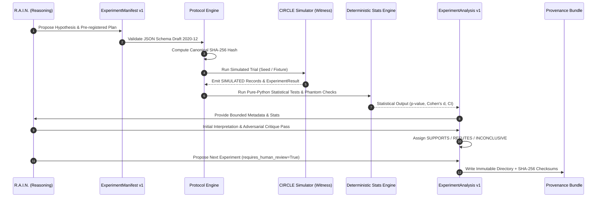

# RAIN ↔ CIRCLE Experiment Protocol Specification (v1.0.0)

> **ENGINEERING REVIEW ONLY — NOT FOR FABRICATION OR HUMAN CONNECTION.**

The **RAIN ↔ CIRCLE Experiment Protocol** establishes a reproducible, deterministic scientific workflow connecting the reasoning capabilities of **R.A.I.N. Lab** (`james_library`) with the provenance and sensing semantics of **CIRCLE** (`circle`).

---

## 1. Architectural Philosophy

```
R.A.I.N. reasons.
CIRCLE witnesses.
The protocol connects them without collapsing their responsibilities.
```

The integration preserves a strict epistemic boundary between hypothesis design, witness evidence, deterministic calculation, and scientific critique.



---

## 2. Epistemic Provenance Classes

The protocol reuses CIRCLE's native provenance vocabulary without modification:

| Provenance Class | Definition & Allowable Context |
|---|---|
| `RAW_MEASURED` | Direct, unmodified sensor ADC recordings from physical hardware (disabled in V1). |
| `DERIVED` | Deterministic mathematical calculations (means, variances, Cohen's d, p-values). |
| `MODEL_INFERRED` | Algorithmic inferences or LLM interpretations (requires model lineage). |
| `SIMULATED` | Synthetic data generated by the simulated CIRCLE executor. |
| `TEST` | Synthetic validation vectors or harness tests. |
| `INTERVENTION` | Actuation commands and stimulus events (requires decision lineage). |

> [!CAUTION]
> **Simulated records cannot be classified as `RAW_MEASURED`.**
> Any attempt by a simulation executor to emit `RAW_MEASURED` records is rejected with an epistemic violation error. LLM explanations can never become experimental evidence.

---

## 3. Lifecycle & Protocol States

1. **Hypothesis & Preregistration**: R.A.I.N. proposes the research question, independent/dependent variables, controls (sham, electronic phantom), sample size, and falsification criteria before data collection.
2. **Deterministic Hashing**: The manifest is serialized canonically (sorted keys, compact whitespace) and hashed (`manifest_sha256`).
3. **Execution**: The `SimulatedCircleExecutor` executes the trial, producing CIRCLE session records (`session_id`, `intervention_id`, `decision_id`, `crc32c`).
4. **Deterministic Analysis**: The Python engine verifies that `execution_manifest_sha256 == original_manifest_sha256`. If mismatched, `protocol_status = "PROTOCOL_CHANGED"` and the conclusion is forced to `INCONCLUSIVE`.
5. **Artifact Discrimination**: If the observed response is replicated in the electronic phantom control ($\ge 40\%$ magnitude), the system flags `POTENTIAL_INSTRUMENTATION_ARTIFACT` and downgrades biological claims.
6. **R.A.I.N. Interpretation**: R.A.I.N. receives only bounded statistical outputs and quality flags to generate an initial interpretation.
7. **Adversarial Critique**: A secondary pass challenges the initial interpretation against alternative explanations, phantom artifacts, and uncontrolled confounders. Both the initial analysis and adversarial critique are preserved.
8. **Conclusion Assignment**: The tri-state conclusion (`SUPPORTS`, `REFUTES`, `INCONCLUSIVE`) is recorded.
9. **Next-Experiment Proposal**: A structured next-step proposal is generated with `requires_human_review: true` (never auto-executed).
10. **Provenance Bundle**: An immutable directory `experiments/EXP-XXXXXXXX/` is created with verified SHA-256 checksums.

---

## 4. Contract Hierarchy & Schemas

| Contract | Purpose | Ownership |
|---|---|---|
| `contracts/rain-circle/experiment-manifest.schema.json` | Preregistered experimental design & analysis plan | RAIN ↔ CIRCLE Bridge |
| `contracts/rain-circle/experiment-result.schema.json` | Execution metadata, CIRCLE session links, artifact hashes | RAIN ↔ CIRCLE Bridge |
| `contracts/rain-circle/experiment-analysis.schema.json` | Deterministic stats, critique, tri-state conclusion | RAIN ↔ CIRCLE Bridge |
| `contracts/session-record.schema.json` | CIRCLE-native session event and stream record | CIRCLE |
| `contracts/resonance-intervention.schema.json` | CIRCLE-native intervention parameters & safety lineage | CIRCLE |

---

## 5. Identification & Blinding Conventions

- **Experiment IDs**: `EXP-[0-9A-Fa-f]{8,}` (e.g., `EXP-BFFF32C5`)
- **Trial IDs**: `TRL-[0-9A-Fa-f]{8,}` (opaque random tokens; never encodes active vs sham condition)
- **Execution IDs**: `EXEC-[0-9A-Fa-f]{8,}`
- **Randomization IDs**: `RND-[0-9A-Fa-f]{8,}`
- **Blinding Tokens**: `BLIND-[0-9A-Fa-f]{12,}`

---

## 6. Conclusion Semantics

- **`SUPPORTS`**: Preregistered statistical criteria ($p < \alpha$, $|d| \ge d_{\text{min}}$, $n \ge n_{\text{min}}$) favor the alternative hypothesis with no unresolved artifact flags. **`SUPPORTS` does not mean proven.**
- **`REFUTES`**: Preregistered falsification criteria are satisfied under adequate statistical power. **Absence of statistical significance ($p > \alpha$) alone does NOT equal refutation.**
- **`INCONCLUSIVE`**: Mandatory whenever sample size is inadequate, sensors fail, clock sync degrades, artifacts are detected, or protocol hashing indicates tampering (`PROTOCOL_CHANGED`).

---

## 7. Safety Boundaries & Physical Hardware Extension Point

```
V1 BACKEND: STRICTLY SIMULATED
```

- **V1 Hard Boundary**: V1 does not energize electrodes, connect to humans, or bypass safety interlocks.
- `PhysicalCircleExecutor`: Represents a stub interface that raises an explicit safety error (`DISABLED in V1: Hardware remains ENGINEERING REVIEW ONLY`).
- Future physical executors will require formal engineering review gate closure and human operator confirmation.

---

## 8. CLI Usage & Reproducibility

### Run Standard Experiment
```powershell
python launcher/rain_lab.py experiment `
  --question "Does 40Hz acoustic resonance alter phantom impedance?" `
  --hypothesis "40Hz stimulation induces impedance drop > 15%" `
  --frequency 40.0 `
  --samples 30 `
  --seed 42
```

### Run Standard Verification Fixtures
```powershell
# Positive Control (SUPPORTS)
python launcher/rain_lab.py experiment --fixture positive

# Negative Control (REFUTES / INCONCLUSIVE)
python launcher/rain_lab.py experiment --fixture negative

# Electronic Phantom Artifact (POTENTIAL_INSTRUMENTATION_ARTIFACT -> INCONCLUSIVE)
python launcher/rain_lab.py experiment --fixture artifact

# Sample Size Insufficiency (INCONCLUSIVE)
python launcher/rain_lab.py experiment --fixture insufficient

# Protocol Modification Detection (PROTOCOL_CHANGED -> INCONCLUSIVE)
python launcher/rain_lab.py experiment --fixture protocol-mod
```

### Verify Provenance Bundle Integrity
```powershell
python launcher/rain_lab.py experiment --verify-bundle experiments/EXP-XXXXXXXX
```
